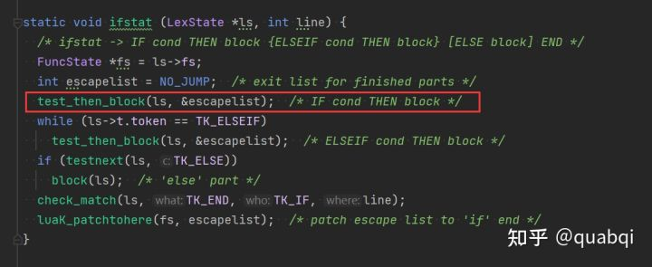
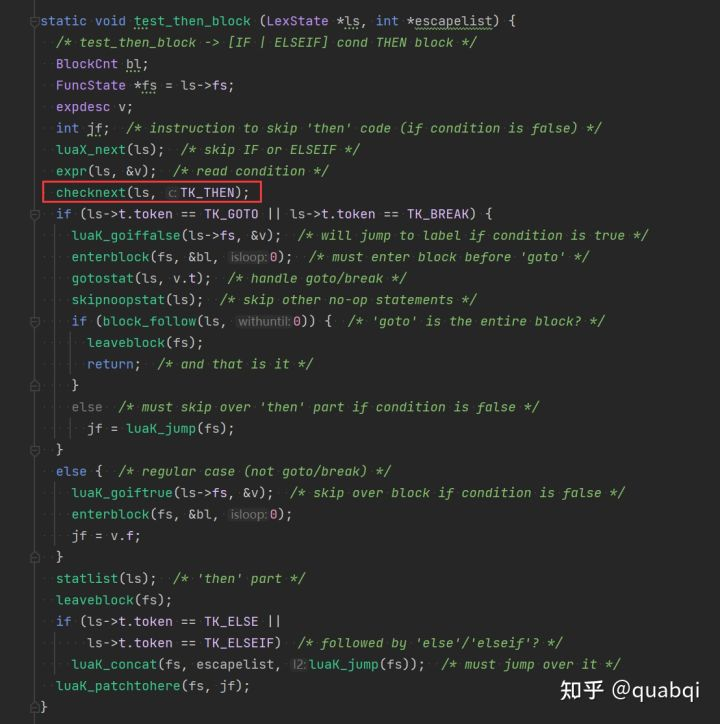

# lua

>total：作为嵌入式程序移植到其他应用程序，底层是c实现的；简单却强大；
>
>redis 可以用 lua来定制自己的redis命令，来保证原子性；
>
>线上lua  ，wiki.luatos.com  
>
>文档 ：https://openresty.org/en/components.html


####**lua 脚本开发的好处：**

* **lua脚本在redis中原子执行的，执行过程中不会插入其他的命令；**
* **lua脚本可以帮助开发和运维人员定制自己的命令，并且可以将这些命令常驻在内存中，实现复用效果；**
* **lua脚本可以将多条命令一次性的打包，有效的减少网络传输的开销；**


wiki.luatos.com  

***LuatOS* 是运行在嵌入式硬件的实时操作系统**


因为lua的if后面直接就是条件，加一个then可以作为条件表达式的终止标记，而end作为block的终止标记，这样lua的解析器就可以很方便的识别对应的区域。对比C++的if，语法是if (xxx) { yyy; } 有小括号可以作为条件表达式xxx的终止标记，有大括号可以作为yyy block的起始和终止标记。可以看lua的源码lparser.c，需要专门用then来检测


**其实换行符就是行结束符 \n**      **就是php的；**

**then 就是条件的结束符**   **只if条件语句**         **因为 if 没有括号 无法知道条件到哪里结束； then代表的是条件的结束；**

**end 就是大括号的结束；**

**do 代表循环体的开始**








`````lua
-- # 数据类型；nil numbers  boolean strings tables（数组 数组的遍历）  循环(for while）
-- while condition do end  for i=10，1；-1 do 循环体  end；
--  判断 if then 必须加then 就是比较特殊while 直接do end 就可以了；其实都一样 then 表示条件的结束 条件语句的开始 do 代表循环的开始，条件的结束；
--  注意 在lua 0 是真的；

--因为lua的if后面直接就是条件，加一个then可以作为条件表达式的终止标记，而end作为block的终止标记，这样lua的解析器就可以很方便的识别对应的区域。对比C++的if，语法是if (xxx) { yyy; } 有小括号可以作为条件表达式xxx的终止标记，有大括号可以作为yyy block的起始和终止标记。可以看lua的源码lparser.c，需要专门用then来检测
-- .. 来实现字符串的拼接；concat

print('hello word')
print(notexists)
local a=1
print(a)
local table1={'ceshi','cesh1','ceshi2'}
 local t = {'a','b','c'}
 print(table.concat(t,',')); -- a,b,c 相当于php的implode；
--key value 遍历
--pairs(); 

for index,value in pairs(table1)
do
    print(index)
    print(value)
end

-- map 关联数组；
table1={[1]=1,['x']='ceshi',['c']='aaa',[type]=4}

print(table1.x)
print(table1['c'])
print(table1[1])
print(table1[type])


print(table1)
-- 数组的for遍历
-- for 循环只有开始和结束
--then  判断之后就需要加then?  是的；  then if条件之后就需要加then end;  if条件添加之后需要加 then
-- 循环其实就是 do  end  
-- for 循环 for 初始值，结束值，每次累加值  do 循环体end  i里面的值不能修改 只能使用 break来跳出来；
--
for i=1,#table1
do
print(table1[i])
end

local m=3

while m<=8 
do
print(m)
m=m+1
end

--判断
--lua 布尔类型只有两个取值false和true. 但要注意lua中所有的值都可以作为条件. 在控制结构的条件中除了false和nil为假, 其他值都为真。lua认为 0 和 空字符串都是真！！
if nil then   -- nil false; 是false 其他的都是真；0 和空字符串也是true；
print('true')
else
print('false')  -- false
end

if 0 then
print("ceshifalse")
end

for k=3,1,-1
do
print(k)
end

if 1>100 then
    print("1>100")
    elseif 1<100 then
    print("1<100")
    else
    print('no')
    end
--函数  end 就是} 结束； end 就是函数的结束；
function ceshi(i)
print(i)
end
ceshi(99)


--xpcall
--xpcall有两个参数（处理的函数，函数异常的处理）
----类似java中的try --- catch 不会终止程序的继续运行---有错误  也不会终止程序  会继续往下运行；
--函数没有异常 则不会调用 处理异常的方法
function traceback(err)
print("LUA ERROR: " .. tostring(err))
print(debug.traceback())
end

function main()
self:hello() --function is null
print("hello")
end

local status = xpcall(main, traceback)
print("status: ", status)  --false;


-- 就是一个错误处理函数 就和php一样的；
function main()
self:hello() --function is null
print("hello")
end

function traceback(err)
print("LUA ERROR: " .. tostring(err))
print(debug.traceback())
end

-- 参数的返回


`````


#### lua  redis apiJI

````lua
redis.call("get",key)
redis.call("set",key,value)
redis.call("lrange","KEYS[1]",0,-1)
````


#### redis对lua的管理 

在 redis中执行lua脚本

***eval*()是程序语言中的函数，功能是获取返回值**，不同语言大同小异，函数原型是返回值 = *eval*( codeString )，如果*eval*函数在执行时遇到错误，则抛出异常给调用者。

`````lua
--eval 脚本内容 key(key的个数) key（key列表，这里可以是数组） argv(参数列表（数组）)  这里的列表 就相当于数组  可以使用  --for key,value in ipairs(table_name)
--ARGv   中的ARG指的是"参数"   ===>  argument value 
--eval 'retrun "word"..KEYS[1]..ARGV[1]' 1 hello redis
-- eval 'return "ceshi"' 0  需要return 来返回


--redis-cli --eval script_name.lua key_name


--redis-cli script load lua_name.lua 把脚本加载到内存 然后 会返回一个sha1；

--redis-cli script load "$(cat lua_get.lua)";
end: No such file or directory
root@611cb22c073e:/data# redis-cli script load "$(cat ceshi.lua)"
"a956f56089342cdfafdeb75ec88cc54d5e4e0504"

--下面的命令 可以直接在redis的命令行来运行；
-- script exists sha_name  查看lua脚本是否已经加载到内存中去；
-- script flush 清除内存中所有的脚本
-- script kill  如果脚本 比较耗时，或者lua脚本存在问题，那么lua脚本会阻塞到redis，可以使用kill来啥子正在运行的脚本；

--evalsha 脚本SHA1值  key个数  key列表 参数列表（argv）


---lua-time-limit 5000  redis.conf 配置要打开，就是脚本的最长执行时间；超出就不行了；


--监视日志的产生  监视结果放在那个redis.log 中；
-- redis-cli monitor > /data/redis.log  

--

`````


