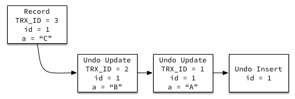

# mvcc 详解


### ex 例子

---

```php
mysql> CREATE TABLE `t` ( `id` int(11) NOT NULL, `k` int(11) DEFAULT NULL, PRIMARY KEY (`id`)) ENGINE=InnoDB;
insert into t(id, k) values(1,1),(2,2);
```


注意：当transaction isolation = rr的时候 重复读 会在执行第一条sql的时候创建一致性视图，read view 是这个事务的一致性视图；rc 读提交 会在每一条语句执行的时候创建一致性视图  这个read view 是这条语句的一致性视图，每一次sql语句都会有一个read view；


###一致性视图 read view（未提交的事务集合）[]

组成：**视图数组和高水位**组成了一致性数组；视图数组就是未提交事务的trx_id的数组；高水位就是当前未提交事务的trx_id+1;


每一次 update 都会创建一个 trx_id 每次update 都会生成一个版本记录；

假设：session A  B C 的trx_id 分别是 100 101 102 

session A : 一致性视图：[100] 100；

session B ： [100,101]101;

session C : [100,101,102]102;

每一次 update的时候 都会执行一次 select 然后再执行 update 写锁 去更新；

版本链 只有 99 update （1，1） -> 102 update （1，2）-> 101 update (1,3)


所以规则就是 

​	1. 当 trx_id 低于低水位的时候 那么就是已经提交的，那么就是可见的

2. 当 trx_id 大于 高水位的时候 表示还未创建 那么就是不可见的；
3. 当 row trx_id 在黄色部分
   * 当在数组内 那么就是没有提交 是不可见的
   * 当在数组外 那么就是表示已经提交的了 所以是可见的


总结 

1. 版本未提交 不可见
2. 版本已经提交，但是在视图创建后提交 不可见；
3. 版本 已经提交，但是在视图创建前 提交的 可见；
4. 当前读  更新数据的时候 是当前读

**可重复读的核心就是一致性读（consistent read）；而事务更新数据的时候，只能用当前读。如果当前的记录的行锁被其他事务占用的话，就需要进入锁等待。**


###**多版本并发控制MVCC：**

>**实现select 读不加锁；**  

read view 一致性试图  

mvcc  提高并发的读写性能；

MVCC的实现？


读提交和可重复读 read view 生成的位置不同；

read view 

当前读  select for update； update select insert 都是当前读；会更新read view；不然会丢失版本； 因为update 肯定要修改最新的数据；

快照读： select 


总之在**RC隔离级别下，是每个快照读都会生成并获取最新的Read View；**

而在**RR隔离级别下**，**第一条sql语句，会创建一个readview**；则是同一个事务中的**第一个快照读才会创建Read View**, 之后的快照读获取的都是同一个Read View。每一个当前读会重新创建一个新的**read view**；


**redo log 用于数据的灾后重新提交不同**

**undo log 主要用于数据修改的回滚。**

与 redo log 记录的是物理页的修改不同，undo log 记录的是逻辑日志。

当 delete 一条记录时，undo log 中会记录一条对应的 insert 记录，反之亦然，当 update 一条记录时，它记录一条对应相反的 update 记录，如果 update 的是主键，则是对先删除后插入的两个事件的反向逻辑操作的记录。



这样，在事务回滚时，我们就可以从 undo log 中反向读取相应的内容，并进行回滚，同时，我们也可以根据 undo log 中记录的日志读取到一条被修改后数据的原值。
正是依赖 undo log，innodb 实现了 ACID 中的 C – Consistency 即一致性。


不可重复读指的是，**在一个事务开启过程中，当前事务读取到了另一事务提交的修改。**
幻读则指的是，**在一个事务开启过程中，读取到另一个事务提交导致的数据条目的新增或删除。**数据的数量的变化；

脏读，**在一个事务开启过程中，我可以读到另外一个事务没有提交的数据；**


**依靠 binlog 是无法保证 crash safe 的，因为 binlog 是事务提交时写入的，如果在 binlog 缓存中的数据持久化到硬盘之前宕机或断电**


真的很不错呀；https://www.cnblogs.com/xuwc/p/13873611.html


缓存池的概念   https://blog.csdn.net/wuhenyouyuyouyu/article/details/93377605


**InnoDB的缓冲池缓存什么？有什么用？**

缓存表数据与索引数据，**把磁盘上的数据加载到缓冲池，避免每次访问都进行磁盘IO**，起到加速访问的作用。


操作系统，会有**缓冲池**([buffer](https://so.csdn.net/so/search?q=buffer&spm=1001.2101.3001.7020) pool)机制，避免每次访问磁盘（攒到一定的量 然后才开始刷脏页，减少磁盘的读写次数；），以加速数据的访问。os buffer；


前我们曾经介绍过，**操作系统为了减少了磁盘的读写次数，提升系统的 IO 性能，会在内存空间中分配一个缓冲区**，这就是页面高速缓冲，虽然高速缓冲让 IO 性能得以大幅提升，但在宕机等异常发生时，这部分在高速缓冲区中的数据就会丢失，因此 unix 提供了系统调用 fsync来让我们手动执行高速缓冲到磁盘的刷新工作


// 关闭自动提交；

set autocommit=0;

主要是为了实现 读-写冲突不加锁的问题：


**说白了 MVCC 提高数据库的并发性能； 实现读-写冲突不加锁（这边的不加锁代表的是当前读不加锁）；而这个读指的就是`快照读`, 而非当前读，当前读实际上是一种加锁的操作，是悲观锁的实现**   **解决了读 写  写读 的冲突问题； 写写还是会阻塞；**


**像`不加锁`的 select 操作就是快照读，即不加锁的非阻塞读；**

<font color=red>*快照读 是不会加读锁，自然读写就不会冲突；快照读不会枷锁；**</font>


select lock in share mode 共享锁；

select for update; update; insert; delete 排他锁；


mvcc 的实现主要分为三部分：隐式字段（DB_TRX_ID 事务的id）（DB_ROLL_ID 回滚id） undolog   	Readview；

read view 就是一个事务IDS 是一个由未提交的事务组成的区间  当大于 这个区间的最大值的时候 代表整个事务还没有创建那么也是不可见的；当处于未提交区间内，那么也是不可见的，只有处于小于区间的低水位的事务才是可见的；


当前读
像 select lock in share mode (共享锁), select for update; update; insert; delete (排他锁)这些操作都是一种当前读，为什么叫当前读？就是它读取的是记录的最新版本，读取时还要保证其他并发事务不能修改当前记录，会对读取的记录进行加锁

快照读
像不加锁的 select 操作就是快照读，即不加锁的非阻塞读；快照读的前提是隔离级别不是串行级别，串行级别下的快照读会退化成当前读；**之所以出现快照读的情况，是基于提高并发性能的考虑，快照读的实现是基于多版本并发控制，即 MVCC ,可以认为 MVCC 是行锁的一个变种，但它在很多情况下，避免了加锁操作，降低了开销；****既然是基于多版本，即快照读可能读到的并不一定是数据的最新版本，而有可能是之前的历史版本**


因为当一个事务  执行当前读的时候会加写锁（悲观锁）；

当我们在另外一个事务中 或者本事务中快照读是不加锁的无阻塞的；**不需要加读锁，自然也就不会和写锁冲突**；


当没有mvcc的时候，写读 读写 都会冲突；因为你去读一个数据需要给数据加读锁，防止被修改；写一个数据需要加写锁，防止被其他的线程修改；所以这边读写是冲突的；

|      | 写锁 | 读锁   |
| ---- | ---- | ------ |
| 读锁 | 冲突 | 不冲突 |
| 写锁 | 冲突 | 冲突   |


MVCC 多版本并发控制是 「**维持一个数据的多个版本，使得读写操作没有冲突**」 的概念，只是一个抽象概念，并非实现
因为 MVCC 只是一个抽象概念，要实现这么一个概念，MySQL 就需要提供具体的功能去实现它，「**快照读就是 MySQL 实现 MVCC 理想模型的其中一个非阻塞读功能**」。而相对而言**，当前读就是悲观锁的具体功能实现**
