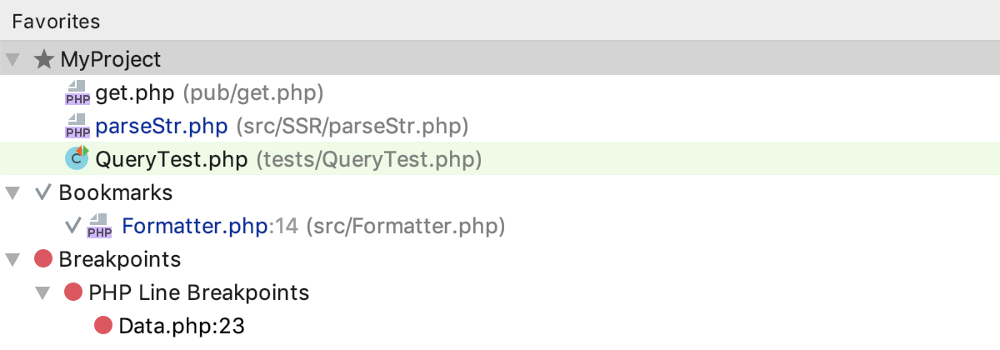
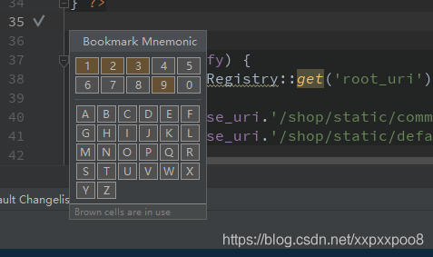
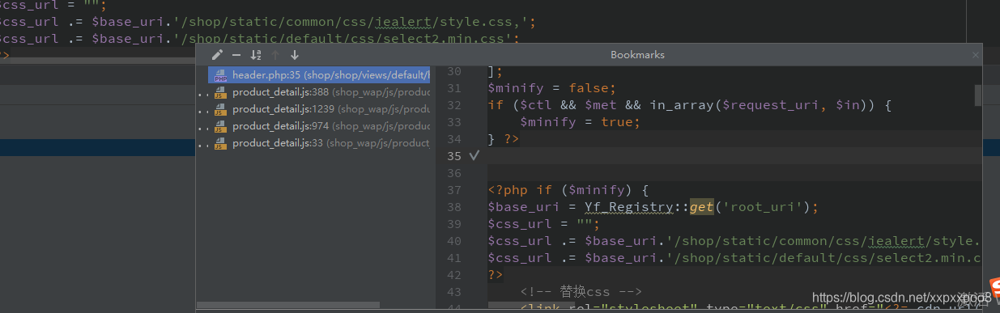
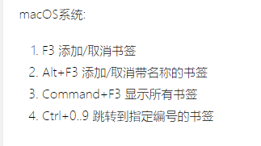

# phpstorm中的查询

>select 快捷键查询；
>
>快捷键；


---

**全文索引；**

ctrl + shift+N    根据 文件名的查询name   ==== ctrl + n；类名等于文件名； 所以直接搜索 ctrl + shift +n  就可以了；

ctrl +N       根据类名进行查询;  

ctrl+shift+alt+N    类名 变量名的索引；  symbols 变量名 方法名 （属性和方法）的查询；symbol  符号表；

>----
>
>
>
>f   代表的是fields 就是;  字段 属性；
>
>constants  常量  const 定义一个常量；
>
>\$ 变量
>
>fx 面向过程的函数
>
>m method 面向对象的方法； 
>
>-------
>

​	**注意：方法名，变量名，和函数名，常量，都是保存到符号表里面的，这些都是通过 symbols来查询；都是存放在符号表；都是符号表查询的一种；**

---


**shift+shift     可以进行方法名  类名 文件名的查询,还包括phpstorm的全局查询；一般是方法名的查询; 注意和内容的全文索引，ctrl+shift+f的区别**

ctrl+shift +A  配置<font color=red>phpstorm</font>的配置全局查询；**action**   全局配置；


 **文件内的搜索；**  **ctrl+f  查询一个文件中的方法 一定要加（ 来去除其他的参数；eg：ceshi(   搜索；**


<font color=red>**ctrl+shift +F 文件内容的查询 全局搜索;全文索引； 针对的文件内容的查询；** </font>

ctrl+E 查询最近使用的文件

ctrl +shift+E 查看最近修改的文件

ctrl +shift + backspace 返回上一个修改的地方；


CTRL+ALT+l 格式化代码  
CTRL+ALT+I 自动缩进

ctrl + alt +s  settings phpstorm 系统配置

---

<font color=red>根文件结构有关的命令</font>

ctrl + click 去查看这个类；


ctrl + u  **找到这个类的父类；**

ctlr + alt + b **查看谁去实现过整个接口类  或者 继承了抽象类；  一般就是查看子类；**  一般是接口或者是抽象类；


alt + 7查看整个文件的structure；文件结构


<font color=red>**ctrl + shift + alt + u 生成UML图 ；可以选中多个文件来生成；**</font>    Ctrl+Alt+Shift+U

---

很重要的一些命令 建议看一下；

一、查看子类
Windows系统下
Ctrl+Alt+B
MacOS系统
Alt+Command+B
如果只有一个子类，则回直接跳转。否则就回显示一个列表

二、查看父类或父类同名方法
Windows系统下
Ctrl+U
MacOS系统
Command+U
如果只有一个父类，或者只有一个父类的方法，则直接进入。否则显示一个列表。

三、查看类的层次结构图
使用快捷键如下：Ctrl+H 

`````php
//查看某一个类的结构图；属性或者方法；
// 并不是类与类关系的UML图；
`````


四、生成UML图
选中类名，按下：Ctrl+Shift+Alt(command)+u
同时选中多个文件，按下可以生成多个类的组织结构图'

五,ctrl + 鼠标左键或者ctrl+ B来定位类的位置；快速定位，追踪函数或者类；


**Ctrl + B 快速定位 追踪函数或者类 ** 

**Ctrl + Shift + B 搜索使用该函数或者方法或者类的文件**

---


**xdebug调试的快捷键：**

run shift + f10

debug shift+f9


step over    **f8 单步执行遇到子函数直接跳过，不会进入子函数内单步执行；**

step into f7   单步执行，**遇到子函数的进入到子函数 并且单步执行；**

step out shift f8  直接退出子函数的运行； 返还到原先的断点调试；

  


---


**alt窗口的调试**


alt 1 工作区 关闭和开启   项目的开启和关闭 项目目录区的开启和关闭；

**alt2 favorite  这个有什么作用？？？**  就是一些断点 和 书签的收藏夹 ；


alt 4  run 窗口

alt 5 debug 窗口

**alt + 7 structure** 

alt + 8 service docker

alt + f12 terminal


alt9 git窗口  版本库 情况；比较常用；  git log;

alt 0 commit 窗口  git commit 要提交的窗口；

---


**translation的快捷键**
ctrl + shift +y 翻译
ctrl + shift + x 翻译并且替换  很好用  可以用英语来替换汉语，小驼峰，大驼峰都支持；或者变量带下划线的；

ctrl + shift +O 召唤翻译的窗口


-----


**php - document** 

  ctrl + q 就是查看 php 文档；


git  


ctrl +k commit  提交本地版本库；


ctrl + shift + k   git push;


ctrl + alt +a  git add . 提交到暂存区之后才能进行分支的切换；


<font color=red>//todo 可以去了解一下 ctrl + T会出现多个分支来merge 或者去rebase?? 这个可以去看看</font>


**Ctrl + Shift + E** 查看最近的变化


---

 快捷键占用问题

* 一个是你本身操作系统的软件占用；比如我的就被翻译软件占用过ctrl+shift+a;
* vim 和ide 按键重复问题；可以通过 setting->editor->vim emulator  来进行修改冲突问题；conflict question；


---

算是一个vim的快捷键把；

ctrl  + w  extend selection   扩展 选择 就是选中 第一次先选择一行 然后选择一个类，然后选择一个文件  

按键 esc 然后取消选择；

ctrl + shift + w shrink selection 缩小选择；shrink 缩小；


---

alt+2 favorite 收藏夹 

**alt2 favorite  这个有什么作用？？？**


# 收藏夹

当您的项目包含成千上万个文件时，浏览它们可能很繁琐。通常，比项目的其余部分需要更多的文件或文件夹。要快速访问此类文件，请将它们添加到“ **收藏夹”**列表中。

该列表可以包括文件，文件夹， 书签和[断点](https://jetbrains.com.zh.xy2401.com/help/phpstorm/using-breakpoints.html) 。收藏夹将保存到“ 收藏夹管理器”组件节点下的.idea / workspace.xml文件。


PhpStorm将断点和书签自动添加到“ **收藏夹”**列表中。


总会有一个与项目同名的预定义空列表。您可以根据需要创建更多列表并在它们之间移动项目。



每当您需要访问自己喜欢的项目时，请按Alt+2或选择**查看|工具窗口|**菜单中的**收藏夹** 。

要打开一个或多个收藏夹项目，请在列表中选择它们，然后按F4 。


添加 直接选中文件点击右键，然后add to favorites,就可以了，删除直接用-来进行删除，其实就是一个收藏夹；

**breakpoints 就是含有断点的文件，自动收藏到breakpoints目录内；**

**bookmarks 书签；**  选中文件 然后F11  然后进行书签的标记；

书签的跳转 是通过 ctrl+1 

I created a bookmark for my favourite website.
我为自己最喜欢的网址创建了一个书签。


----


bookmarks 为了加快开发速度，短期功能，多个页面来回切换开发是很有必要的，如果手工查找，切换速度太慢,so

1. F11 添加/取消书签
2. Ctrl+F11 添加/取消带名称的书签
   
   有颜色的说明是已经添加的bookmark
   可以使用 ctrl+数字，快速切换到对应的代码块
3. Shift+F11 显示所有书签
   
4. Ctrl+0…9 跳转到指定编号的书签




---

