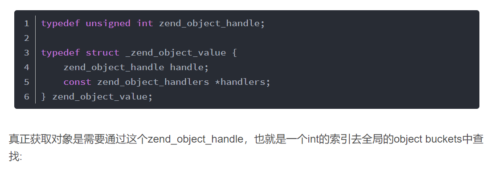

# php易错点

### 全局变量 global $GLOBALS

用全局变量最好使用$GLOABLS 可以保持内外环境变量的一致性；

**global+变量  就是在函数内部创建一个引用指向外部的全局变量；** 

**这边global的原理就是创建一个引用指向外边的变量，所以我们自然可以通过 &来改变引用的指向；**

我们操作的是引用，指向的都是同一个zval变量容器，可以使用&符号来破坏这个规则，所以全局变量最好使用**$GLOABLS超全局变量**来解决这个问题;

$GLOABLS就是内外部环境的一致性；也就是我们直接操作外部变量；

如何重置一个引用：

~~~~
$c = 789;
$a = 123;
$b = & $a;
$b = 344;
echo $b,$a."\n";
$b =  & $c;
echo $b,$c."\n";
// 结果
344344
789789
~~~~

**所以当处于这种情况下会出现内外环境不一致的情况,所以尽量不用global；**

~~~
function sum(){
	global $a,$b;
	$a = & $b;
	echo $a."\n";
}
$a = 1;
$b = 2;
sum();
echo $a."\n";
//结果是
2
1
~~~

### static 静态变量

静态变量：官方给的定义是：程序执行前**静态分配**存储空间的一类变量；也就是在编译的时候就给分配内存空间；

特性：

* 编译的时候分配内存空间；
* 初始化，不赋值，默认是0；
* 生命周期: 整个程序运行期间；（在程序运行结束前，静态变量的值都不会丢失；）
* 作用域:函数内；(函数外不能调用，除非你继续调用函数，才能继续操作静态变量）

静态属性  你就看成一个 全局变量就可以，所有的人都可以调用和访问；

静态方法也可以；

### 传值 ，传引用

php 其实是一个心直耿直boy；

**& 就是传引用**；函数内改变，形式参数的值，实际的变量也会发生变化；

**不带 & 都是传值；**  

传值的时候会产生copy，然后放在栈中，形式参数的改变不会对实际参数产生任何的影响；

**对象有点例外，其实就是跟随java的脚步；**也是为了代码里面少点& 好理解一些；

有人会疑惑?看下面的zvalue联合体，php5中对象是一个指针，那么值传递到底是传的是引用还是值；

~~~
struct _zval_struct {
    union {
        long lval;
        double dval;
        struct {
            char *val;			//存放的是指针
            int len;          //php直接保存字符串的str，所以strlen的时间复杂度是O(1)
        } str;
        HashTable *ht;               //数组  存放的是地址 指针
        zend_object_value obj;       //对象 php5 这里是一个指针，php3，php4，赋值的时候需要赋值整个对象（copy），所以效率非常低，在php5做了优化，跟随java的步伐，采用了指针或者句柄的形式;
    } value;                    //变量value值
    zend_uint refcount__gc;   //引用计数内存中使用次数，为0删除该变量
    zend_uchar type;           //变量类型
    zend_uchar is_ref__gc;    //区分是否是引用变量
};
~~~

**传值，只不过整个值是   整个对象的指针，所以可以在函数内对整个对象直接进行操作；**

**资源和对象是传引用需要另外一套计数方式，来回收资源和对象；**

~~~
class  Person{
    public $age = 0;
    public $name = "zhangsan";
}
function test($obj){
    $obj->age = 99;
    $obj->name = "lisi";
}
$obj = new Person();
test($obj);
echo $obj->name;
//结果
lisi       //操作的是同一个对象	
~~~

**php5之前，要想直接操作实际参数，必须传引用；注意这点区别；**

