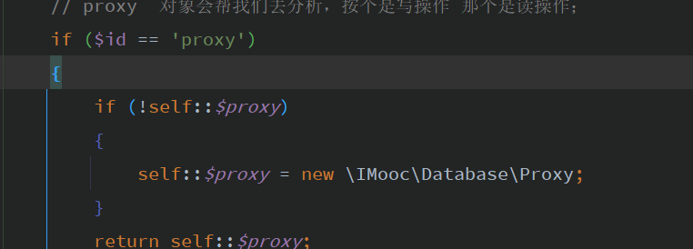

#  require  and  include

>require  and  include ;

---


**require  引入外部文件；**

**require 当文件不存在 或者存在错误的时候，直接error错误，不再往下运行；**

**include  也是引入文件，但是当文件不存在或者存在错误，报warning的错误，并且继续往下运行；**

**require_once 引入文件的次数，当引入多次的时候只有第一次生效；**

**include_once   因为需要判断是否引入过该文件，所以效率会比单纯的include 和require 效率低一些；**


---


##  call_user_func_array();

```php
//// 不需要new 直接调用; 不需要new 直接调用就好了  在call_user_func(); 在内部会自己newInstance
//call_user_func_array(array('Ceshias', 'ceshi'),array(1,2));
//call_user_func(array('Ceshias','ceshi'),1,2);
class TEST90
{
    public static function ceshi($a) {
        echo $a;
        echo "\n";
        echo 'ceshi';
    }
}
call_user_func(array('TEST','ceshi'),'ccc');  // 可以引用静态方法！！！
```


## list 函数


list  列表  把数组的值赋值给一组变量；可以使用

````php
// list

$a = 1;
$b = 2;
//list($a,$b) = array($b,$a);
[$a,$b] = array($b,$a);  // php7+
echo $a,$b;

````


##  代理proxy

因为是稳定的所以我们这里是可以new的；




## php语言的优势

---

````php
#1.面向对象语言，php是脚本语言(就是解释性语言呗；)，主要适用于web开发；
#2. 语法和编程 是弱类型 和 动态语言，语法比较灵活；
#3.生态和社区，生态有很多框架 laravel和 php本身没有的一些功能，可以用扩展来扩展功能模块，也有自己的类库管理工具composer，社区也比较活跃，去找问题也比较简单；
#4 性能差一些，有成熟和完备的api函数；php开发比较快！！比较适合快速开发！！！开发速度比较快，周期短！！
````