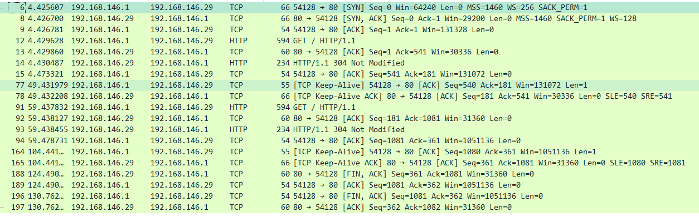

# wireshark charles


##注意 抓本地的wireshark 一定要选  loopback  我是傻逼；哈哈

### wireshark

>按照ISO层级进行抓取

**数据链路层**	

​	 eth.addr == mac地址

```shell
#addr  dst 或者 src 都可以；
eth.addr == 00:00:5e:00:53:00
eth.dst == 00:00:5e:00:53:00
```


**网络层**

ip.addr == ip地址

````shell
# dst 或者src  都可以；
ip.addr == 192.168.146.29
# dst 目的地址；
ip.dst == 192.168.146.29  
````


**传输层**

tcp.port == 80

tcp.dstport == 

tcp.srcport == 

**协议的过滤**

tcp arp http icmp 之类的过滤


**与或非**

**not, and, or**


**否(“not”)具有最高的优先级。或(“or”)和与(“and”)具有相同的优先级，运算时从左至右进行。**

**“not tcp port 3128 and tcp port 23″与”(not tcp port 3128) and tcp port 23″等价。**


### 运算符


==   !=  >=  <=  < > 


### eg


**ip.addr == 10.1.1.1**

**ip.src != 10.1.2.3 or ip.dst != 10.4.5.6**          

**ip.src == 10.230.0.0/16 显示来自10.230网段的封包。**


**tcp.port == 25 显示来源或目的TCP端口号为25的封包。**

**tcp.dstport == 25 显示目的TCP端口号为25的封包。**


<font color=red>**request  就是请求行的意思； reponse  就是响应行的意思；** </font>  

**http.request.method== "POST" 显示post请求方式的http封包。**

**[http.host](https://link.zhihu.com/?target=http%3A//http.host) == "[一听蓝皮统计系统](https://link.zhihu.com/?target=http%3A//tracker.1ting.com)" 显示请求的域名为tracker.1ting.com的http封包。**


###whireshark  查看一下  keepalived的应用；

**查看 一个ke'e'palived**

G:\wireshark\true.tcp.keepalive.pcapng  这个是下面的抓包的目录；

tcp or http and ip.addr == 192.168.146.29 and !ip == 1.1.1.1 and tcp.port == 54128

**tcp or http and ip.addr == 192.168.146.29 and !ip == 1.1.1.1 and tcp.port == 54128**



####与或非     && ! II  and  not or  逻辑运算符 结果是真假；


**注意 与位运算符的区别  结果是一个二进制数字；**


1. &  与  |    或   ~非   ^ 异或（不同为1）
2. <<   >>    左移 和右移   **>>> 运算符（无符号右移）**


