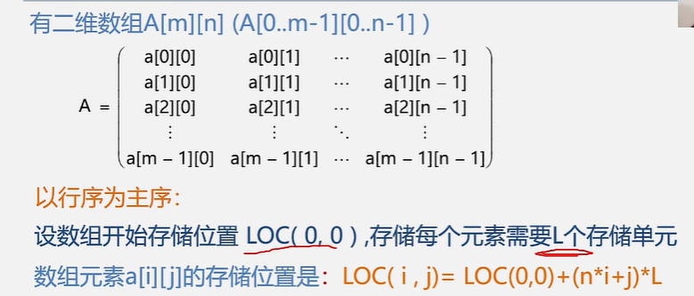

# 二维数组的存储 


二维数组在概念上是二维的，但在内存中是连续存放的；换句话说，二维数组的各个元素是相互挨着的，彼此之间没有缝隙。那么，如何在线性内存中存放二维数组呢？有两种方式：

- 一种是按行排列， 即放完一行之后再放入第二行；

- 另一种是按列排列， 即放完一列之后再放入第二列。

  

在C语言中，二维数组是按行排列的。也就是先存放 a[0] 行，再存放 a[1] 行，最后存放 a[2] 行；每行中的 4 个元素也是依次存放。数组 a 为 int 类型，每个元素占用 4 个字节，整个数组共占用 4×(3×4)=48 个字节。

你可以这样认为，二维数组是由多个长度相同的一维数组构成的。


##  按行存储 ---- 行序是主序

跟下标有关的的计算公式；

```php
//a[i][j]   c中假设数组的内容都是
//a[m][n]   1<=i <=m      1<=j<=n
//L代表的是每个元素的存储单元；
// i*n*L +j*L  
// 这样计算地址；

```



​					n代表的是列数字；

## 按列存储--- 列序是主序


## 多维数组


’


