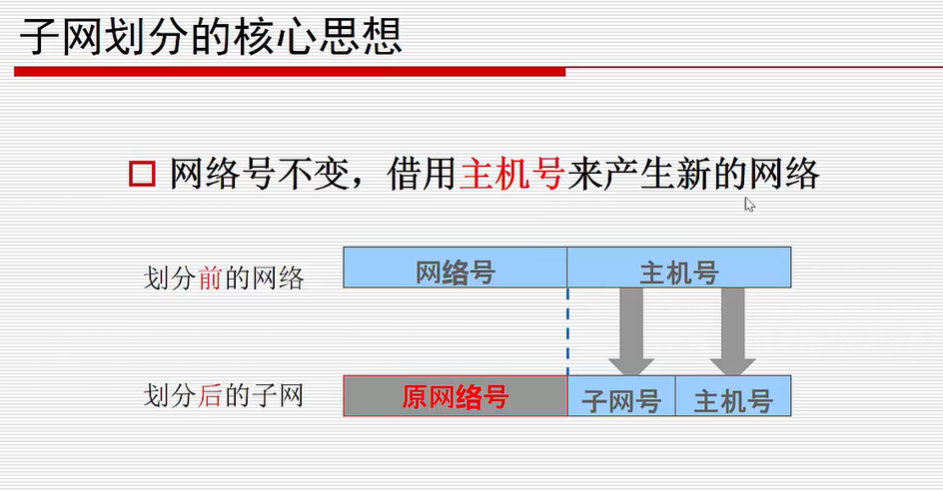

# 带宽 宽带 流量 网速  内网 外网

ctrl + shift +l 隐藏左边的文件列表 typora的快捷键 ，随笔记忆一下；

---

**注意 平常运营商说的1M的宽带 其实下载速度才是128kb/s ；**（1024/8）

### 带宽 

>运送货物的带子的宽度，越宽速度越快，就先这样理解把

* 是一个量词，代表的是网速的大小
* 单位 1Mbps 一兆比特每秒  这个数值就是带宽 1Mbps = 125KBps
* 他和电脑的下载速度存在着换算的关系  因为我们平常使用电脑下载单位是kB/s Byte 字节和 位bit的  

###  宽带

* 这里是一个名词，其实实际意思就是代表 有没有网络  或者代表的是一个具体的数字
* 带宽是 512kbps 以上的才叫宽带把，所以至少速度是64kB/s的网速

### 区别 

* 宽带是一种名词，或者说是一种业务，宽带是传输速度
* 

### 网速 

*   就是就是我们平常说的下载速度
*  单位是 MB/s  1B = 8bit

### 内网

一般我们使用的都是内网，比如 10.   172.16-31，或者192.168. 开头的一般都是私有ip ，也就是内网

### 外网

可以 [点击查看](https://ip.cn/)自己电脑的外网ip

或者使用 tracert -4  -d  www.sina.com 测试一下就知道了 我们的外网ip

一开始自然分类 分类 abcde类 但是ip不够用

所以 出现了**子网掩码 告诉你的ip地址主机号和网络号分别是多少位**

192.168.1.1  255.0.0.0  网路号用1来表示 1 主机好用0来表示 也就是8位网络号 24位主机号

192.168.1.1/8  8代表的是8位网络号；CIDR (无类别域间路由（Classless Inter-Domain Routing、*CIDR*）)

如果一个ip地址 主机号是x位，那么可以给2^x -2 个主机，**全0是网络地址，全1是广播地址；**arp

申请就申请一个网段 200.1.1.0/24 分为三个部门 50 20 10 人

子网划分 核心》》》》》》》》》》》》》》》》》》》》》

2^8 -2 = 256-2=254个主机；一共可以有254个主机；

### 

**分为三个网络以上，并且 每一个网络的主机号都大于等于50；**（这种划分太浪费IP 每台电脑一个ip 所以现在分为公网ip 和私网ip）

假设子网号是n

那么：

2^n >=3  

2^8-n - 2 >=50

结果是n=2；每个子网的主机数目是 2^6-2 62台电脑

