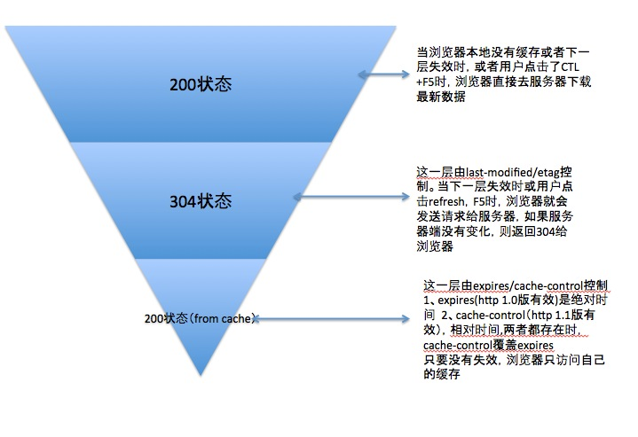

# HTTP缓存

> HTTP缓存分为强制缓存（expire和cache-control）和 协商缓存(last-modified和Etag)；
>
> 强制缓存的优先级高于协商缓存；
>
> 强制缓存不会走服务器，所以直接读取本地的缓存；
>
> 只有协商缓存，才会请求服务器，没有新的缓存，才会返回304；
>
> 检查是存在浏览器的内存或者是磁盘，就看看有没有持久化就可以了，保存在内存就关闭浏览器就会消失；

****

在请求一个静态文件的时候（图片，css，js）等，这些文件的特点是文件不经常变化，将这些不经常变化的文件存储起来，对客户端来说是一个优化用户浏览体验的方法。那么这个就是客户端缓存的意义了

// nginx 是可以更改 http头部 这个 是web服务器所必须的 当然nginx更可以支持在 HTTP头部中的行馆信息 增加浏览器缓存，加快网页的加载速率。

浏览器的三种的缓存方式 

第一种是 last-modified 根据更新的时间 来判断 是否再次加载  当有的时候 也就是  直接返回的是 304 也就是不需要再次加载了 

expire 

//这个的缓存一般是很针对于一些.不是经常变化的，例如css和js 或者是一些大的图片的缓存。

Etag

windows下客户端的缓存文件存放在临时文件夹中，但是这里有个问题就是这个缓存文件存放多久呢？这个是由服务端进行设置的。

**Expires/Cache-Control**

HTTP头中的Expires和Cache-Control就是完成这个事情的。

当客户端第一次访问资源的时候，服务端在返回资源内容的同时也返回了Expires: Sun, 16 Oct 2016 05:43:02 GMT。

服务端告诉浏览器： 你Y的先把这个文件给我缓存起来，在这个过期时间之前，这个文件都不会变化了，你下次需要这个文件的时候，你就不要过来找我要了，你就去缓存中拿就好了，又快又好。

浏览器回答说：诺。

 

于是在第二次html页面中又要访问这个资源的时候，并且访问的日期在Sun, 16 Oct 2016 05:43:02 GMT之前，浏览器就不去服务器那边获取文件了，自己从缓存中自食其力了。

 

但是呢，浏览器毕竟是在客户端的，客户端的时间可是不准确的，用户可以随着自己的喜好修改自己机器的时间，比如我把我机器的时间调成Sun, 16 Oct 2016 05:43:03 GMT，那么呢？我的浏览器就不会再使用缓存了，而每次都去服务器获取文件。于是，服务器怒了：给你个绝对时间，你由于环境被修改没法判断过期，那么我就给你相对时间吧。于是就返回了Cache-Control: max-age:600，浏览器你给我缓存个10分钟去。于是浏览器只有乖乖的缓存10分钟了。

 

但是问题又来了，如果有的服务器同时设置了Expires和Cache-Control怎么办呢？（不是闲的没事干，而是由于Cache-Controll是HTTP1.1中才有的）那么就是根据更先进的设置Cache-Control来为标准。

//这句话是错误的，好了，现在有个问题，我有个文件可能时不时会更新，服务端非常希望客户端能时不时过来问一下这个文件是否过期，如果没有过期，服务端不返回数据给你，只告诉浏览器你的缓存还没有过期（304）。然后浏览器使用自己存储的缓存来做显示。这个就叫做条件请求。

**Last-Modified/ If-Modify-since**

客户端第一次访问资源的时候，服务端返回资源内容的同时返回了Last-Modifed:Wed, 07 Aug 2013 15:32:18 GMT 服务端在告诉客户端：你获取的这个文件我最后的修改时间是Wed, 07 Aug 2013 15:32:18 GMT 。浏览器在获取这个文件存到缓存中的时候，给缓存中的文件同时记录上这个最后修改时间。

 

第二次访问的时候（我们假设这里没有设置expires或者cache-control）。那么服务端访问资源的时候会带上If-Modify-since:Wed, 07 Aug 2013 15:32:18 GMT ；

 

客户端询问服务端：喂，我需要的这个资源其实我这边已经有缓存了，我的缓存文件的最后修改时间是这个是，如果你那边的资源在这个时间以后没有修改的话，你就告诉我一下就好了，不需要返回实际的资源内容。反之，要是你有修改的话，你就把文件内容返回给我吧。

服务端回应说：哦。行为是看下资源是否在这个时间后没有修改过，如果没有修改返回个304告诉客户端，我没有修改过。如果有变化了，我就返回200，并且带上资源内容。

 

这个条件请求还有另外一种方法，打标签（Tag）。

**ETag/ If-None-Match。**

第一次客户端访问资源的时候，服务端返回资源内容的同时返回了ETag：1234，告诉客户端：这个文件的标签是1234，我如果修改了我这边的资源的话，这个标签就会不一样了。

第二次客户端访问资源的时候，由于缓存中已经有了Etag为1234的资源，客户端要去服务端查询的是这个资源有木有过期呢？所以带上了If-None-Match: 1234。告诉服务端：如果你那边的资源还是1234标签的资源，你就返回304告诉我，不需要返回资源内容了。如果不是的话，你再返回资源内容给我就行了。服务端就比较下Etag来看是返回304还是200。

**各种刷新**

理解了上面的缓存标签之后就很好理解各种刷新了。

刷新有三种

**浏览器中写地址，回车**

**F5**

**Ctrl+F5**

 

假设对一个资源：

浏览器第一次访问，获取资源内容和cache-control: max-age:600，Last_Modify: Wed, 10 Aug 2013 15:32:18 GMT

于是浏览器把资源文件放到缓存中，并且决定下次使用的时候直接去缓存中取了。

 

浏览器url回车

浏览器发现缓存中有这个文件了，好了，就不发送任何请求了，直接去缓存中获取展现。（最快）

 

下面我按下了F5刷新

F5就是告诉浏览器，别偷懒，好歹去服务器看看这个文件是否有过期了。于是浏览器就胆胆襟襟的发送一个请求带上If-Modify-since：Wed, 10 Aug 2013 15:32:18 GMT

然后服务器发现：诶，这个文件我在这个时间后还没修改过，不需要给你任何信息了，返回304就行了。于是浏览器获取到304后就去缓存中欢欢喜喜获取资源了。

 

但是呢，下面我们按下了Ctrl+F5

这个可是要命了，告诉浏览器，你先把你缓存中的这个文件给我删了，然后再去服务器请求个完整的资源文件下来。于是客户端就完成了强行更新的操作...

 

还有说一下，那个ETag实际上很少人使用，因为它的计算是使用算法来得出的，而算法会占用服务端计算的资源，所有服务端的资源都是宝贵的，所以就很少使用etag了。

我自己的理解。 也就是说，200的就是第一次回车请求数据的时候或者是ctrl +F5 强行刷新数据，的时候删除缓存重新请求服务器 请求成功的时候就返回200，304的状态也是有两种产生的方式，一个是当你回车（也是相当于刷新的时候 ）的时候，expires 和max-age 的时候 当两者都存在的时候以max-age 为依据，当缓存没有过时的时候，返回的是304，再一个就是，F5强制刷新的时候，也就是说，对浏览器别偷懒，去服务器再去看看

还有没有更新，再去给我看看，然后如果没有更新返回的依然是304 基本就两种的状态

其实这些信息 就放在http的header头里面,都是从服务器那里传递过来的数据。

几个的关键词

cache-control   expires  max-age last-modified  最后的修改事件

或者是Etag 用一个标志的形式  ，去请求有没有更新。

检查的时候在 下面的network 就看一看都网页的状态和header头

## 优先级

强制缓存高于协商缓存

Etag （if-none-match）高于 if-modify-since （last-modified）

强制缓存中 ，cache-control 高于 expire； cache-control 是http1.1 expire 是http1.0 

##xml 和 json的区别

　　·JSON

　　优点：

　　（1）轻量，请求时对带宽的要求小

　　（2）多种服务器语言都有创建JSON格式的模块、方法，便于跨平台使用和后期维护

　　缺点：

　　（1）在不了解JSON结构的情况下，客户端方便的编程不能够正确使用JSON

　　·XML

　　优点：

　　（1）格式统一，扩展性强()???表现在那些地方？  tag 可以随便写？？？ 节点随便扩展  和 tag 任意取名字；

　　（2）可读性强

　　缺点：

　　（1）文件大

　　（2）客户端解析难度高

　　（3）维护不方便

　　（4）浏览器之间解析的方法不一致，导致代码重写率提高

 
