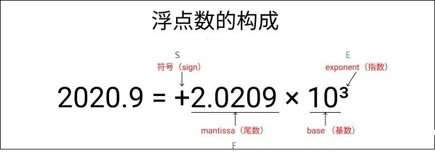
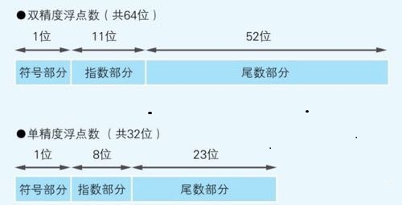

# 浮点数的原理

><font color=red>**那么 科学计数法表示为：(-1)^S * 1.F* 2^(E - 1023)  **</font>
>
>**很多小数是没法使用二进制来进行精确表示的，只能是一个近似值； 所以会存在精确度损失的问题；**
>
>decimal  是不存在
>
>1. 浮点数（Floating-Point）：浮点数是一种基于二进制的数值表示方式。它使用科学计数法来表示数值，包括一个有效数字和一个指数。浮点数可以表示非常大或非常小的数值范围，但在计算时可能会引入舍入误差。由于浮点数使用二进制表示，某些十进制数值可能无法精确表示，导致精度丢失。

---

### 浮点数

* 为啥叫浮点数，而不是叫小数，或者可以说浮点数和小数的区别？

  * 因为资源的限制，数学中的有些小数无法直接在计算机中准确的表示，所以出现了**浮点数，这是对小数的近似值，浮点数永远小于小数；**
  * 因为浮点数，仅仅是小数的近似值，所以我们在计算的时候经常出现问题，最完美的解决方案就是选择更加**精确的数据类型；**
  * 可以举一个例子，二进制的小数基数可以用 0.5  0.25 0.125 0.0625 ...来表示，要想用这些数据来表示这所有的小数 那是不可能的，例如 0.3  0.1  0.2 就没法准确的表示 ，所以仅仅是近似值； **这里你可以比喻 10 进制存在无限不循环小数  也是无法用 十进制的准确的数来表示；**
* IEEE754  定义的规则   
  * 要求二进制小数必须是1开头，那么F尾就会多一位的范围，float就是24位，double就是53位；更加精确了；
* 浮点型的组成（下面的图片是10进制案例）

  * 

  * 符号：（-1）^S
  * 尾部：IEEE754要求二进制的第一位必须是1,也就是 1.F
  * 基数：这里基数是2  也就是说是2进制的  在IEEE754中基数是省略的 因为都是2；
  * 指数：**<font color=red>因为指数肯定有负数也有正数，所以会减去1023 中间数来做判断符号正负，大于1023就是正数，小于1023就是负数； 0 - 1023;</font>**
* 浮点型 主要分为  也就是单精度float和双精度 double  分别是4个字节和8个字节
  * 

<font color=red> **所以浮点型的精度由 尾部来决定**</font>

> 当由int整型long溢出转换成浮点型的时候肯定是要失真的；

**double 52位 尾部长度  2^53 大于这个数都会失真；**  

**float 尾部是24位  2^24 大于这个数也会失真；**

那么 科学计数法表示为：(-1)^S * 1.F* 2^(E - 1023)  


**在科学计数法中，为了使公式简便，可以用带 “E” 的格式表示。例如 1.03乘10的8次方，可简写为 “1.03E+08” 的形式，其中 ”E“ 是 exponent(指数) 的缩写。”**


**如果是从64位操作系统, 会存在一个  long  到 double转换 然后再到long的一个转换，要想精确不失真就需要不超过 2^53次方；**


<font color=red>**总而言之：当long超过PHP_INT_MAX (2\^63-1)之后就会越界，从long类型转换成double类型；但是会失去精度；只能保持2\^53的精度；**</font>


``````php
//越界问题；  
echo pow(2,10);
echo "\n";
$intmax = PHP_INT_MAX; //  === 2^63 -1 ;    9223372036854775807

echo $intmax;
echo "\n";

echo gettype(pow(2,63)-1); //double 因为 计算出2^63已经超出界限了，所以是double -1 之后自然也是double；
if($intmax == (pow(2,63) - 1)){ //equal 不能是全等；数据类型不一样；
    echo "equal\n";
}

$switchdouble = (double)$intmax;  //9.2233720368548E+18 失真了；

echo $switchdouble;
echo "\n";
echo gettype($intmax); // long
echo "\n";
echo gettype($intmax + 1);// 越界直接转换成double 类型
echo "\n";

echo $intmax + 1;
$doubleprecious = 2^53;

// 为什么 double 类型表示的位数 要更多呢
// 
//其实就是指数部分；
``````


## 整型溢出 转换成浮点型 double 肯定要失真；只要底数大于 2^54 就会失真；；；；；

如果 是因为溢出 转换成了浮点的话，必定失真；；；；；

其他方式的转换，只要大于2^54  就会失真；


## 小数和浮点数

````php
小数和浮点数是两种不同的数值表示方式，它们在存储和计算精度上有所不同。

小数（Decimal）：小数是一种基于十进制的数值表示方式。它使用固定的位数来表示整数部分和小数部分，并且可以精确地表示和计算十进制数值。小数通常用于需要高精度计算的场景，如货币、金融和科学计算。小数的计算结果是准确的，不会出现舍入误差。

浮点数（Floating-Point）：浮点数是一种基于二进制的数值表示方式。它使用科学计数法来表示数值，包括一个有效数字和一个指数。浮点数可以表示非常大或非常小的数值范围，但在计算时可能会引入舍入误差。由于浮点数使用二进制表示，某些十进制数值可能无法精确表示，导致精度丢失。

主要区别如下：

精度：小数提供了精确的十进制计算，而浮点数在某些情况下可能会有精度丢失。
表示范围：浮点数可以表示非常大或非常小的数值范围，而小数的表示范围相对较小。
存储方式：小数通常以固定点数形式存储，而浮点数以二进制形式存储。
计算效率：浮点数的计算速度通常比小数快，因为硬件和编译器对浮点数的支持更好。
//在选择使用小数还是浮点数时，需要根据具体的应用场景和需求来决定。如果需要高精度的计算结果，并且对范围要求不是特别大，小数是一个更好的选择。
//如果需要处理非常大或非常小的数值范围，并且可以容忍一定的精度丢失，浮点数可能更适合。
````

