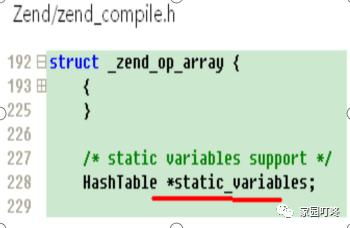

# 理解几个概念

#### 并发  

####  

**一次可以接收多个请求；并发；**

#### 多个进程被一个cpu来处理，这就是并发；

#### 并行  （并行并且并发；）主要区别就是有多个处理器；

#### 几个cpu就去处理几个进程，这里就是并行；

####串行  

**一次只能处理一个请求，可以看成队列，后面的线程会被阻塞；**

#### 线程安全

**同一个进程多个线程去修改线程变量，**

#### 分布式锁

**分布式锁式一种跨进程和跨机器节点的一种互斥锁**；它可以用来保证多个机器节点对共享资源的排他性；

线程锁的生命周期是单进程，多线程；

**分布式锁生命周期是多进程多机器节点；**

#### php的并发问题

**就是多进程的问题；负载均衡；**

**CAP模型**

####原子操作

就是要么不做，要不就做完；针对的是一个或者多个操作；一个或者多个对象；

原子操作是不可分割的，**在执行完毕之前不会被任何其它任务或事件中断**。

####事务

**一系列操作要么失败要么成功；**

可以看成多个对象的原子操作；

那么就可能存在死锁的问题；如果加锁可能存在死锁的问题；

cow copy on write 大对象，可以先赋值一份，然后修改完，

#### 全局变量，静态变量

内存分配：都存在符号表中，symbal_table

作用域不同：**程序执行期间一直存在；从程序的开始到结束；** 他会在请求结束的时候释放全局变量和静态变量，但是符号 表之类的会在，模块关闭的时候释放内存；

#### 局部变量

内存分配：函数内，存在于临时栈内，当执行完之后生命周期结束；内存就会被回收；**生命周期**

作用域不同：函数执行期间存在；函数执行完成之后就会被回收；

####消息队列的异步：了解一下

**削峰**

**解耦**

**异步**

#### 并发编程三要素：

**原子性：不可分割的操作，一个或者多个操作要保证同时成功同时失败；**

**有序性：程序执行的顺序和代码的顺序保持一致；**

**可用性：一个线程对共享变量的修改，另外一个线程立马看到；**

####持久性：

持久性，意味着在事务完成以后，**该事务所对数据库所作的更改便持久的保存在数据库之中，并不会被回滚。**

（完成的事务是**系统永久的部分**，对系统的影响是永久性的，该修改即使出现致命的系统故障也将一直保持）

**write ahead logging**：SQL Server中使用了WAL（Write-Ahead Logging）技术来保证事务日志的ACID特性，在数据写入到数据库之前，**先写入到日志，再将日志记录变更到存储器中。          **    **由随机写变成了顺序写；**

####隔离性：

**多个事务并发访问时，事务之间是隔离的**，一个事务不应该影响其它事务运行效果。

#### \$_SESSION  的跨页面的能力；

**原子性 了解一下：**

**导读：**针对多个对象的原子操作，引入事务或者事务内存的概念，实际上的实现要么是写日志，要么是依赖于 COW 或加锁的方式，最终依赖于原子指令。

**作者 | 子札**

## 前言

所谓原子操作，就是要么不做，要么全做。在很多场景中，都有对原子操作的需求。在翻 aep 的 spec 文档时，也发现了一个巧妙的方法。所以顺便发散性地总结一下各种实现原子操作的方法，欢迎大家交流探讨。

## 小粒度——指令

根据 intel 手册卷三第八章的描述，**x86 使用三种机制来实现原子操作：**

\1. Guaranteed atomic operations。Guaranteed atomic operations 是指一些基本的读写内存操作，这些操作都是保证原子性的。一般来说，读写位于一个 cache line 中的数据是原子性的。

\2. bus lock，使用 LOCK# 信号和指令的 lock 前缀。锁总线的方式很简单，进行原子操作的 cpu 会在 bus 上 assert 一个 LOCK# 信号，此时其他 cpu 的操作都会被 block 住。

\3. cache lock，利用 cache 一致性协议（MESI 协议）来实现。如果要访问的内存区域已经在当前 cpu 的 cache 中了，就会利用 cache 一致性协议来实现原子操作，否则会锁总线。

**Intel 早期 cpu（如 Intel386、Intel486、奔腾处理器）实现原子操作，是通过 bus lock 来实现的。**这种实现的问题，是完全不相关的两个 cpu 之间，也会相互竞争总线锁，从而导致整体性能下降。在后来的 cpu 中，intel 对这一问题进行了优化。当要进行原子操作的内存已经被拉入 cache 中时，cpu 会使用 cache 一致性协议来保证原子性，这被称为 cache lock。相比于 bus lock，cache lock 粒度更细，能获得更好的性能。

x86 中，有些指令是自带 lock 语义的，比如 XCHG，更新段描述符等等；另外一些指令可以手动加上 lock 前缀来实现 lock 语义，比如 BTS、BTR、CMPXCHG 指令。在这些指令中，最核心的当属 CAS（Compare And Swap）指令了，它是实现各种锁语义的核心指令。不同于自带原子语义的 XCHG，CAS 操作要通过"lock CMPXCHG"这样的形式来实现。一般而言，原子操作的数据长度不会超过 8 个字节，也不允许同时对两个内存地址进行 CAS 操作（如果可以的话，免锁双向链表不是梦）。

原子操作中另一个绕不开的话题是 ABA 问题，水平有限，就不展开讲了。简单提一个例子，在 linux 内核的 slub 实现中，用上了一个宏 cmpxchg_double，这并不是同时对两个内存地址进行 CAS 的黑魔法，而正是利用 CMPXCHG16B 指令解决 ABA 问题的宏函数，有兴趣的可以深究一把。

## 大粒度

当原子操作的对象大小在 16 字节或者 8 字节以内时，一两条指令就能实现原子操作。但是，当对象的大小较大时，实现原子操作的就需要其他方法了，比如加锁和 COW。深究这两种方法，可以发现，**在本质上，它们还是将问题转换成了 16 字节的原子操作。**

- **加锁**

加锁这个方式很好理解，只要一加锁，整个临界区的操作就可以被看作一个原子操作。

内核中提供了各种各样的锁，自旋锁、读写锁、seq 锁、mutex、semaphore 等等，这些锁对读写者的倾向各有不同，在是否允许睡眠上也有所不同。

简单来说，自旋锁和读写锁的核心都是利用原子指令来 CAS 操纵一个 32 位/64 位的值，它们都不允许睡眠，但是读写锁对于读者做了优化，允许多个读者同时读取数据，而自旋锁则对于读写操作没有什么偏向性。seq 基于自旋锁实现，不允许睡眠，但是对写者更为友好。mutex 和 semaphore 也是基于自旋锁实现的，但是它们允许互斥区的操作陷入睡眠。

可以看到，**加锁这种方式，最核心的还是利用指令实现原子操作。**

- **COW**

**针对大对象原子操作的另一种方式是 COW（copy on write）。**

**COW 的思想其实非常简单，首先我们有一个指向这个大对象的指针，在需要原子性修改这个大对象的数据时，因为没办法做到 inplace 修改，所以就把这个对象的数据拷贝一份，在对象副本上修改，最后再原子性地修改指向这个对象的指针。可以看到，这里最核心的地方是利用指令来      实现指针的替换。** **写的时候赋值；就是指针的替换；**

关于 COW，这里举一个 AEP 的例子。AEP 是一种存储介质，这里只需要知道它可以按字节寻址和数据在掉电后不消失即可。普通的磁盘，一般有扇区原子性的保证，也就是在将新数据写入某个扇区的途中突然掉电的话，这个扇区上要么完全没有新数据，要么新数据完全被写下去了，不会出现一半新一半旧的状态。扇区原子性的保证很重要，许多数据库都依赖它，然而，AEP 这种存储介质没有这种保证，所以需要用软件的方式来做这种保证，称为 BTT。

BTT 的思路也很简单，为了方便理解，后文我不引入 AEP 的术语来进行描述。

首先把整个存储空间划分成若干个 block，每个 block 有自己的物理块号，然后再维护一个表来做逻辑块号到物理块号的转换。给上层逻辑块的数量略小于物理块数量，这样就会有一部分的物理块没有被映射，姑且称为 free block。

比如下图，4 个逻辑块，5 个物理块，其中 1 号块是 free block。

接下来，在往一个逻辑块上写数据时，先找一个 free block，把数据写上去，接下来去映射表中，将逻辑块的映射修改该 free block。**整个流程中，最关键的一步——修改映射关系——是原子性的。**只要有这个保证，那么就能够提供 block 数据原子性更新的能力。

COW 的思想在很多地方都有，比如 qemu 的 qcow 镜像快照，ext4 和 btrfs 在写入数据时的 COW，linux 内核的 rcu 机制等等。此外，COW 最有名的使用场景莫过于 fork 的实现了，但是它只是单纯的为了减少拷贝开销，与原子性没有太大关系。

- **COW 优化**

COW 的方式，有个很麻烦的事情，就是每次都得原子性的去更新指针。那么有没有办法去掉这个指针呢？有的。

这个是在 Intel 关于 AEP 的文档上学到的另一种取巧的方式（注意，下面描述的例子和上文中的 BTT 没有任何关系）。起因是这样的：

AEP 的驱动使用一个称为 index block 的结构来管理元数据，这个 index block 处于整个介质的起始位置，大小至少为 256 字节。有些操作会去更改它的多个字段的值，所以可能出现更改字段到一半的过程中掉电的情况，因此需要一种机制来保证更改过程是原子性的。

正常的 COW 方式，需要在起始位置处保留两个 index block 大小的空间以及一个指针，其中一个 index block 作为备用。在修改 index block 的数据时，以 COW 的方式将全部的数据存储在备用 index block 中，然后以 COW 的方式更改指针指向该备用 index block 中。

Intel 使用下面的机制来优化掉指针：

依然是两个 index block，index block 中有一个称为 seq 的字段。seq 是一个两位的数，共有 4 个状态。除去 00 状态，还有 01、10、11 三个状态，将这三个状态视为一个循环，如下：

为了方便叙述，两个 index block 分别命名为 blockA 和 blockB。

- 第一次写入数据，写入到 blockA 中，其上的 seq 为 01；
- 第二次写入数据，写入到 blockB 中，其上的 seq 为 10；
- 第三次写入数据，写入到 blockA 中，其上的 seq 为 11；
- 第四次写入数据，写入到 blockB 中，其上的 seq 为 01；
- ……

**如此往复，在恢复时，只要读取并比较两个 index block 上的 seq 中哪个处于循环的前方，就能找到最新的那个 index block。**这样的优势是显而易见的，一是避免了额外的指针，或者说把指针固化到两个 index block 中，避免了一个 8 字节指针对两个 index block 对齐带来的麻烦；二是少一次写操作，提升了效率。

## 多对象

前面针对的都是一个个单个的对象，如果涉及到多个对象，要保证原子性就比较复杂了。比如，如果使用加解锁的方式，就需要注意锁的顺序，防止死锁的问题；如果是 COW 的方式，就需要注意中途失败以后的把已替换的指针回滚回去的问题。**从更大的格局来看，针对多个对象的原子操作，本质上就是进行一次事务操作。**所以，这个问题的解法，参考事务的实现就好了。

## 写日志

事务的四大特征 ACID，即原子性，一致性，隔离性和持久性，基本上是一个常识了，而原子性只是事务的一个特性。

写日志算是实现事务最通用的方式了，日志一般分为 redo 和 undo 两种日志，为了加快恢复速度，一般还会引入检查点（checkpoint）的概念。在文件系统和数据库的实现中，基本上都能看到事务的身影。

**写日志除了能保证原子性和一致性以外，还对磁盘这种外存设备很友好，因为写日志基本上都是顺序的。**在这一方面的典型案例，当属日志结构文件系统和 leveldb 的 LSM-tree 了。

leveldb 的原理想必不用再提了，它把对于 K-V 对的增删改操作都变成一条条的日志，然后持久化为磁盘上的一个个 SST，之后再触发合并整理。这样一来，基本上对于磁盘的所有操作都是顺序的了。

日志结构文件系统也是类似的思想，它将文件数据的增删改操作直接变成日志写到磁盘里面，文件的实际数据不需要单独再存到某个地方，而是靠日志恢复出来。这种做法对写操作是非常友好的，但是读方面的性能就有点差强人意了。

## 事务内存

事务通常是用于保证持久性数据一致性的。去掉持久性的要求，将事务的概念引入到对于内存对象的操控中，就有了事务内存的概念。

**正如上文所说，对于多个对象的操作，加锁和 COW 的方式，在使用时都比较麻烦。加锁的方式要考虑加解锁顺序防止死锁，中途失败了还要按照特定的顺序解锁回滚**；COW 也是一样，虽然没有死锁的问题，但是在回滚上也是很麻烦的。另一个问题就是，针对不同的场景，加解锁的顺序要重新考虑，COW 的回滚也要重新考虑，不具有通用性。

事务内存机制则是为了解决这些问题而提出的，它把针对多个对象的原子操作抽象为一个事务，只要按照它提供的 api，以串行化的思路去编程就行了。不用考虑加解锁的顺序，也不必考虑回滚的问题，在遇到了某些 fatal error 时只要 abort 掉事务即可。**这是一种通用的并发编程方式，简化编码的同时，还能保证并发的性能。**

事实上，事务内存机制的内部实现，也是依赖于 COW 机制和加解锁来实现的，更深一步，其实也是依赖于原子操作指令的。

## 总结

总结一下：

- 16 字节或 8 字节以内的内存数据，使用 cpu 的原子操作指令；
- 16 字节以上的数据，使用加锁、COW 的方式，或者优化过的使用 seq 的 COW 方式，本质上还是依赖于原子指令；
- 针对多个对象的原子操作，引入事务或者事务内存的概念，实际上的实现要么是写日志，要么是依赖于 COW 或加锁的方式，最终依赖于原子指令。

所以，万变不离其宗，原子操作指令很关键。

**参考文章：**

- [https://pmem.io/documents/NVDIMM_Namespace_Spec.pdf](https://link.zhihu.com/?target=https%3A//pmem.io/documents/NVDIMM_Namespace_Spec.pdf)

- [https://software.intel.com/content/dam/develop/public/us/en/documents/325462-sdm-vol-1-2abcd-3abcd.pdf](https://link.zhihu.com/?target=https%3A//software.intel.com/content/dam/develop/public/us/en/documents/325462-sdm-vol-1-2abcd-3abcd.pdf)

- https://zhuanlan.zhihu.com/p/151425608

- [https://zh.wikipedia.org/wiki/%](https://link.zhihu.com/?target=https%3A//zh.wikipedia.org/wiki/%E8%BD%AF%E4%BB%B6%E4%BA%8B%E5%8A%A1%E5%86%85%E5%AD%98)

  

### 符号表 symbol table

1.6:变量的创建

创建变量的步骤: $str = "hello";

1:创建zval结构,并设置其类型 IS_STRING

2:设置其值为 hello

3:讲其加入符号表

{

zval *fooval;

MAKE_STD_ZVAL(fooval);

ZVAL_STRING(fooval, "hello", 1);

ZEND_SET_SYMBOL( EG(active_symbol_table) , "foo" , fooval);

}

**1.7:符号表 symbol_table**

符号表是什么?

符号表是一张哈希表，里面存储了变量名->变量的zval结构体的地址，

**// zend/zend_globals.h 182行**

struct _zend_executor_globals {

...

...

HashTable *active_symbol_table; /*活动符号表*/

HashTable symbol_table;/* 全局符号表 */

HashTable included_files;/* files already included */

1.8:符号表与函数

Zend/zend_compiles.h

struct _zend_execute_data {

...

zend_op_array *op_array; //函数的执行步骤

HashTable *symbol_table; // 此函数的符号表地址

zend_class_entry *current_scope;

zval *current_this;

zval *current_object;

...

};

上面这个,是当前函数执行时的符号表

1.9:符号表与作用域

当执行到函数时,会生成函数的"执行环境结构体",包含函数名,参数,执行步骤,所在的类(如果是方法),以及为这个函数生成一个符号表.符号表统一放在栈上.并把active_symbol_table指向刚产生的符号表

1.10:函数中静态变量的实现

2.0:常量-常量结构体

结构体 Zend/constants.h 33行

typedef struct _zend_constant {

zval value; //变量结构体

int flags; //标志,是否大小写敏感等

char *name; //常量名

uint name_len;

int module_number;//模块名

} zend_constant;

2.1:常量的生成

int zend_register_constant(zend_constant *c TSRMLS_DC) {

...

...

zend_hash_add(EG(zend_constants), name, c->name_len, (void *) c, sizeof(zend_constant), NULL)==FAILURE)

...

...

}

## CAP模型，原理及取舍  

constientcy availability   partition tolerance 

构建服务集群，通常是为了解决单点故障服务直接不可用的问题。那么集群的宗旨就是避免在单点故障时，整个服务不可用。

分布式锁是一个cp模型；redis是一个ap模型；

#### cap理论：

cap理论中包括三个分布式服务的属性：

**可用性**：保证服务可用。

**数据强一致性**：保证在任何提供服务的时间点上，分布式系统中所有节点的数据完全一致。

**分区容错性**：保证当分布式系统中有任一或几个结点发生故障或数据不一致时，整个系统仍能正常提供服务。

**注意**：”数据的强一致性“与”数据的最终一致性“是不同的概念。

由上述概念可知：

这三个属性不可能同时满足，因此，一般的分布式服务中，会优先选择两项进行满足。

**1.舍弃数据强一致性**：

在这种情况下，需要确认当数据缺失时，不会影响服务本身的正确性。举例：

Eureka集群：

有三台Eureka服务发现，其中一台发现了三个，一台发现了四个，一台发现了五个，那么当消费者选取其中任意一台服务发现的时候，都可以获得服务，因此Eureka服务的数据不一致并不影响其正常提供发现服务。

**2.舍弃高可用：**

在选择了分区容错和数据强一致性的前提下，当发生数据不一致时，整个分布式服务将会阻塞，停止向外部提供服务，并且进行数据的同步，在数据完全同步之前不会回复对外的服务，在这种情况下，需要保证数据的完全一致性，因此一定会破坏高可用性。

-----

