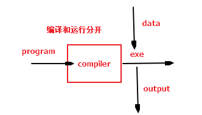
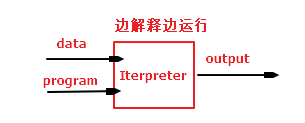
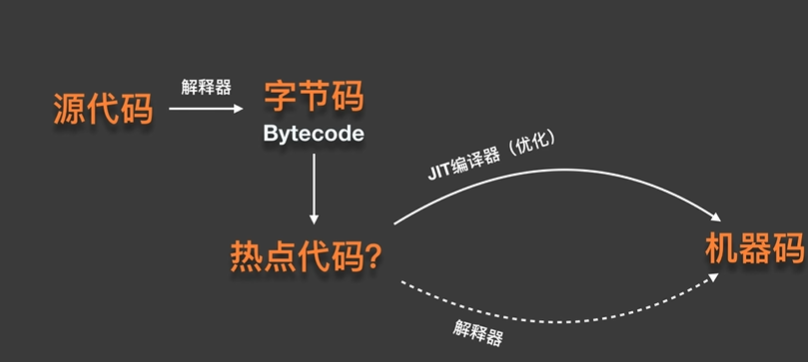
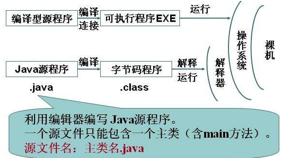
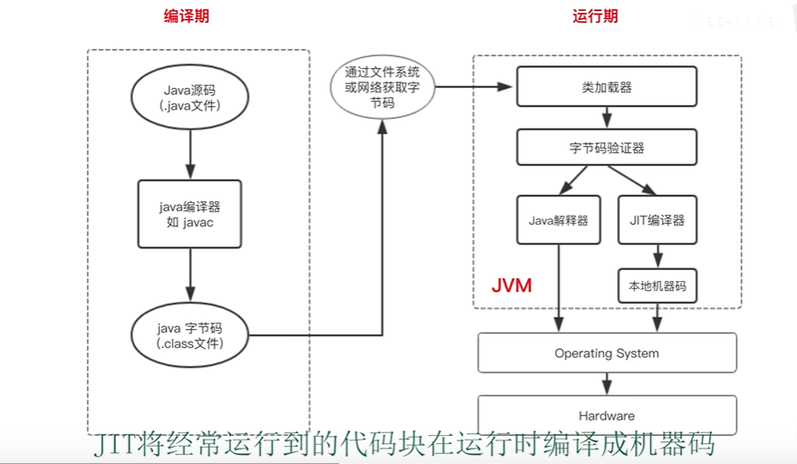

# 解释和编译

>compile：interpreter

特点：

动态语言（脚本语言）：编译的时候就要确定每一个变量类型；

1. 一个变量的类型是申明的时候就已经确定，除了强制转换，不可以发生改变；

静态语言：运行的时候确定每一个变量的类型；

	1. 一个变量可以赋不同数据类型的值；
	2. <font color=red>变量在使用前无需声明类型；</font>
	3. 一个变量的类型是由其上下文决定的，效率更高。


*****

编译型：source code =》machine code（二进制可执行文件，可以在物理机运行）

特点：

1. 一次编译多次运行
2. 运行速度快
3. debug很麻烦 修改之后需要重新生成exe
4. 跨平台不好，移植性差；需要去修改代码；

 

********

解释型：source code =》opcode（中间码 不可以直接在物理机运行）=》machine code（zend虚拟机（可以识别opcode的虚拟机） 翻译成机器码）

* 生成opcode是zend引擎，所有解释运行在zend虚拟机；
* php运行完之后会抛弃opcode，下一次运行需要重新生成；
* php也需要<font color=red>编译</font>生成opcode；

特点：

1. 一边解释一边运行（运行的时候需要解释环境（zend虚拟机））php 运行完一次后会把opcode丢弃，下一次重新生成；可以使用opcache来做一个优化；
2. 运行速度慢
3. 跨平台好（虚拟机）
4. debug很简单

 

**********

强类型：不容忍隐式类型转换；

弱类型：容忍隐形类型转换；

***********

JIT：just in time 即时编辑器，对一些热点代码（hotspot），通过JIT优化，生成机器码，如果在执行热点代码只需要执行生成的机器码就行，就不需要编译（解释器去解释了）了，大大提高了代码的执行效率；

注意在虚拟机 对中间码 转换成机器码做了一个优化 jit 直接去执行就可以了，热点代码，直接执行机器码 就不需要转换成机器码的这个过程了；




**解释和编译**



**概念：**

- **动态语言（弱类型语言）**是运行时才确定数据类型的语言，变量在使用之前无需申明类型，通常变量的值是被赋值的那个值的类型。比如Php、Asp、JavaScript、Python、Perl等等。

```text
var s ="hello";
var i = 0;
var b = true;
```

- **[静态语言](https://www.zhihu.com/search?q=静态语言&search_source=Entity&hybrid_search_source=Entity&hybrid_search_extra={"sourceType"%3A"article"%2C"sourceId"%3A66383937})（强类型语言）**是编译时变量的数据类型就可以确定的语言，大多数静态语言要求在使用变量之前必须生命数据类型。比如Java、C、C++、C#等。

```text
String s="hello";    //String 类型的变量
boolean b=true;    //boolean 类型的变量
int i=0;    //int 类型的变量
```

- **弱类型语言**是数据类型可以被忽略的语言。它与强类型语言相反，一个变量可以赋不同数据类型的值。一个变量的类型是由其上下文决定的，效率更高。
- **强类型语言**是必须强制确定数据类型的语言，一旦一个变量被指定了某个数据类型，如果不经过强制转换，那么它就永远是这种数据类型。一个变量的类型是申明的时候就已经确定的，更安全。


**区别：**

- 静态语言由于强制声明数据类型，让开发工具（IDE）对代码有很强的判断能力，在实现复杂的业务逻辑和开发大型商业系统、以及那些声明周期很长的应用中，开发者可以依托强大的IDE来更高效、更安全地开发。
- [动态语言思维](https://www.zhihu.com/search?q=动态语言思维&search_source=Entity&hybrid_search_source=Entity&hybrid_search_extra={"sourceType"%3A"article"%2C"sourceId"%3A66383937})不受约束，可以任意发挥，把更多的精力放在产品本身上；集中思考业务逻辑实现，思考过程就是实现过程。


## 编译和解释的优点和缺点

编译

优点： 运行速度比较快，一次编译多次运行；

缺点：

* debug（修改代码）的时候需要重新编译；不灵活，修改代码需要重新编译；
* 依赖于平台，如果是在linux上编译，生成的二进制代码，就不能windows上运行，需要交叉编译转换；

解释

优点：比较灵活；不依赖于平台；跨平台比较好；

缺点：运行速度比较慢，多次编译，多次运行；


java 即时JIT；

JIT会把一些经常运行的中间码转换成机器码；


