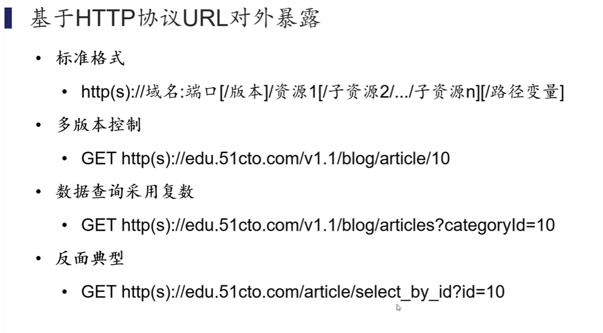
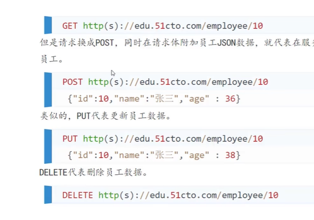
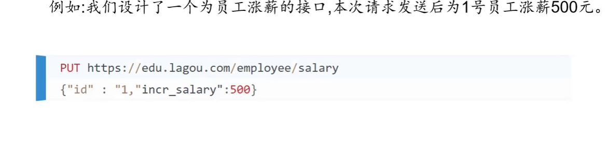
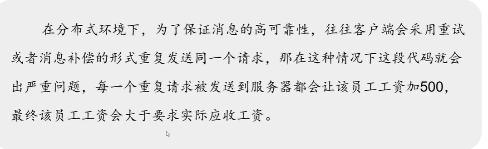
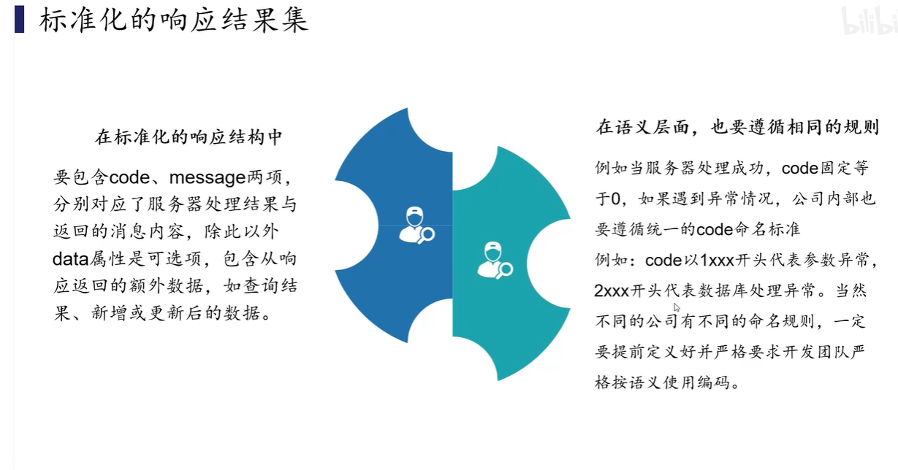
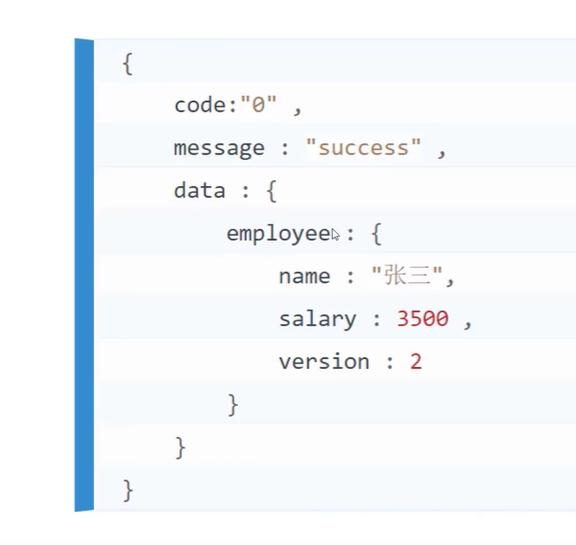
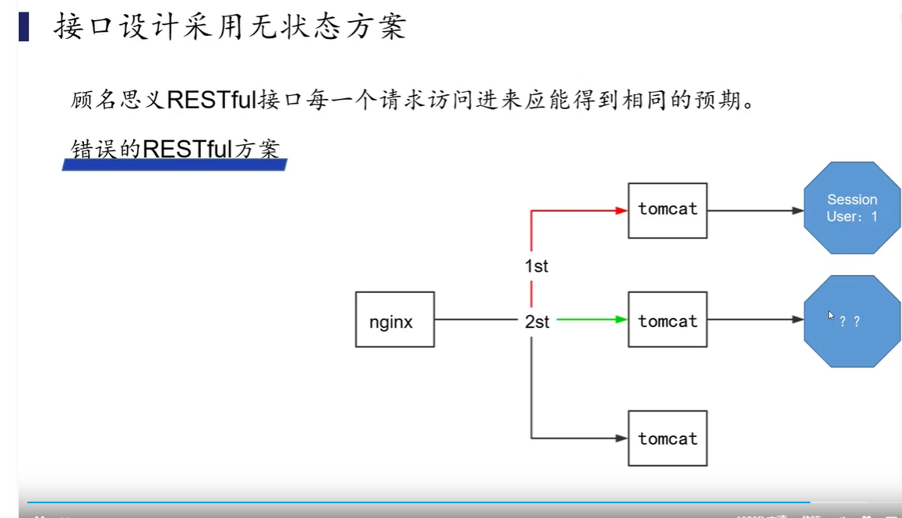
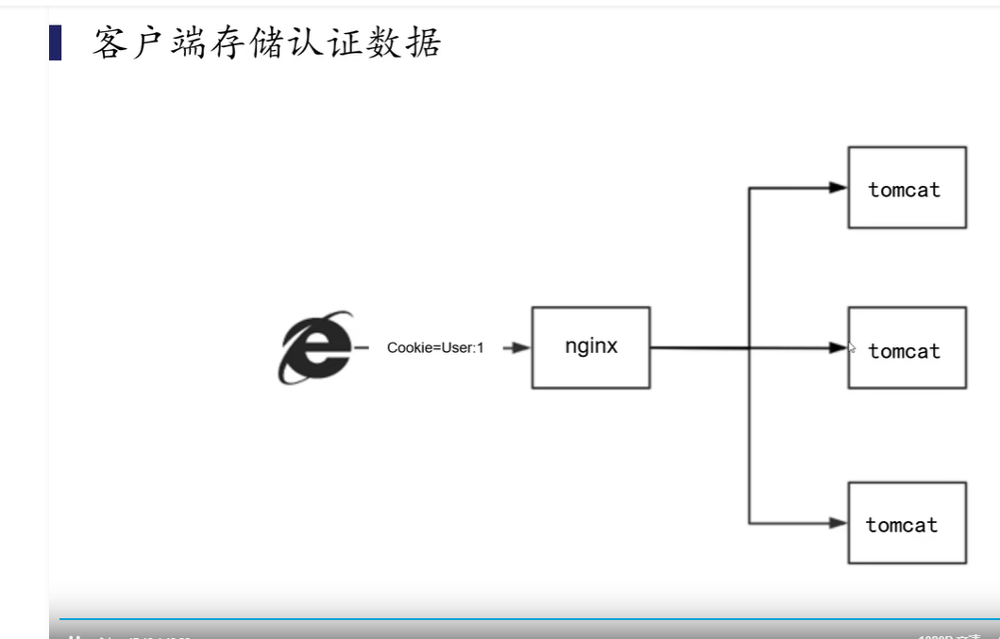
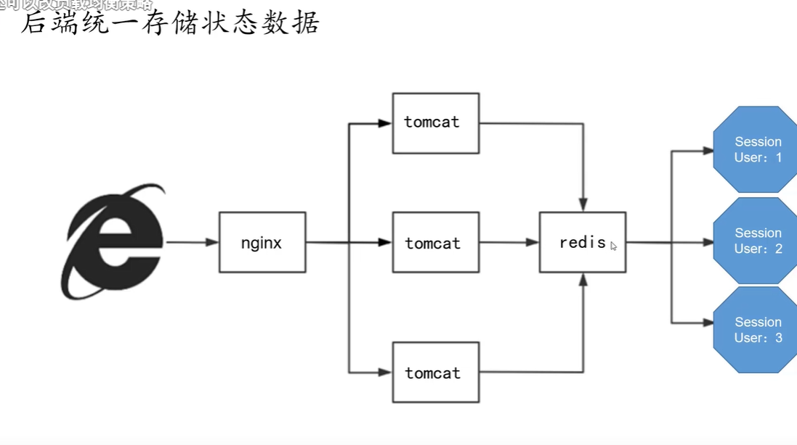

# restful 接口设计


## 设计原则


**##基于http协议URL对外暴漏；**

* http(s)://域名：端口[/版本]/资源1/[资源2/资源3/资源4]\[/路径变量]


* 注意这里的资源名字都是名词；不应该带动词；方法名不对外暴漏；很好安全； 



使用json或者xml数据格式，进行数据的传输；

*  不要包含任何展示的信息；

根据不同行为使用不同的请求方式；

* get  查询资源；
* post  新增一个资源；
* put 现有的资源更新；
* delete  删除资源；




## 注意事项 

注意接口的幂等性设计

幂等性：多次重复请求，接口能保证与预期相符的结果；




//肯定这里不是幂等的；


可以使用乐观锁，加一个字段version；


每次进行更新数据的时候都可以去判断版本号是不是对应的；token + redis 可以实现一个随机字符串把；当更新完成的时候要删除随机字符串；状态机，如果有唯一性的索引也可以使用唯一索引；


meitu  使用的是加一个setnx 的锁 1s的锁；一秒钟不能有重复的订单；提交； 他也是之后产生的；


每次客户端来请求数据都要带版本号；


````php
#幂等性；

#订单的幂等性是怎么处理的；
    
# 订单状态变化的不等性；
````





标准化 处理结果






接口设计的无状态；


如果登录认证信息 放在session；




客户端的存储认证数据；


JWT 客户端数据认证；怎么对数据做加密处理；	




后端统一村塾

