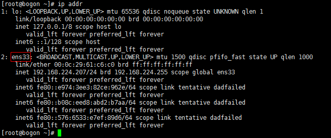

# 负载均衡

**centos 7  首先先要关闭防火墙；**


**1.**

**使用命令:systemctl status firewalld.service 查看防火墙状态**

**2.**

**执行后可以看到绿色字样标注的“active(running)”,说明防火墙是开启状态**

**3.**

**使用命令:systemctl stop firewalld.service 关闭运行的防火墙**

**4.**

**关闭后,使用命令systemctl status firewalld.service 查看防火墙状态 可以看到,disavtive(dead)的字样,说明防火墙已经关闭**


**开机启动；** 创建开机启动；

**[root@localhost ~]# systemctl enable keepalived**
**Created symlink from /etc/systemd/system/multi-user.target.wants/keepalived.service to /usr/lib/systemd/system/keepalived.service.**


**keepalived  d 就是daemon守护神的意思；守护的意思；**


**ln -s    symbol link  软连接 这里要用绝对值；**

`````shell
ln -s /usr/local/nginx/sbin/nginx /usr/local/bin/nginx  
`````


\** $PATH  就这几个目录 去找一下就可以了吧；**

**[root@localhost sbin]# which nginx**
**/usr/local/bin/nginx**


```shell
#scp local_file remote_username@remote_ip:remote_folder   -r参数赋值目录；

[root@localhost keepalived]# scp check_nginx.sh root@192.168.146.133:~
The authenticity of host '192.168.146.133 (192.168.146.133)' can't be established.
ECDSA key fingerprint is SHA256:zCMQroj8FbOqmP7o29RSEdhBZwne/hwHFQyY/qUB2+E.
ECDSA key fingerprint is MD5:ec:9a:6f:d7:fe:4f:c6:f8:31:4f:5f:76:03:7f:dd:be.
Are you sure you want to continue connecting (yes/no)? y
Please type 'yes' or 'no': yes
Warning: Permanently added '192.168.146.133' (ECDSA) to the list of known hosts.
root@192.168.146.133's password: 
Permission denied, please try again.
root@192.168.146.133's password: 
check_nginx.sh   
```

vim 的优化

``````shell
set ts=4  # tab = 4 space
set autoindent  #自动缩进
set cursorline   #  有一条线 很明确的知道哪一行；
##这两个就够了 自动缩进，一个 ts = 4 tab = 4个空格；
``````


`````shell
set ts=4  # tab = 4 space
set autoindent  #自动缩进
set cursorline;
set sm     # 不太好用；                //自动匹配} ] ) ,编程时用
`````

shell的优化

`````shell
#caps lock + l  就是向右移动一个单词
#ctrl +w 删除光标前的单词


输入bind -P可以查看所有的键盘绑定

CTRL相关的快捷键
Ctrl-A 相当于HOME键，用于将光标定位到本行最前面
ctrl+B: 光标左移一个字母
ctrl+C: 杀死当前进程
ctrl+D: 退出当前Shell
Ctrl+E 相当于End键，即将光标移动到本行末尾
Ctrl+F: 相当于右箭头键，用于将光标向右移动一格
ctrl+H: 删除光标前一个字符，同backspace键相同
Ctrl+J: 相当于回车键
ctrl+K: 清除光标后至行尾的内容
	
ctrl+L: 清屏，相当于clear
Ctrl+P 相当于上箭头键，即显示上一个命令
Ctrl+N 相当于下箭头键，即显示下一个命令
ctrl+R: 搜索之前打过的命令。会有一个提示，根据你输入的关键字进行搜索bash的history
ctrl+U: 清除光标前至行首间的所有内容
ctrl+W: 移除光标前的一个单词
ctrl+T: 交换光标位置前的两个字符
ctrl+Y: 粘贴或者恢复上次的删除
ctrl+D: 删除光标所在字母;注意和backspace以及ctrl+h的区别，这2个是删除光标前的字符
ctrl+F: 光标右移
ctrl+Z: 把当前进程转到后台运行，使用fg命令恢复，或者使用bg命令后台运行

ALT相关的快捷键
Alt+<: 移动到历史记录中的第一
Alt+>: 移动到历史记录中的最后一条
Alt+?: 显示当前自动不全提示
Alt+*: 插入所有的自动不全提示
Alt+/: 不全文件名
Alt+.: 用于提取历史命令中的最后一个单词
Alt+B: 向前移动光标
Alt+C: 用于将当前光标处的字符变成大写，同时本光标所在单词的后续字符都变成小写
Alt+D: 删除单词
Alt+F: 向后移动光标
Alt+L: 用于将光标所在单词及所在单词的后续字符都变成小写
Alt+N: 向后查找历史记录
Alt+P: 向前查找历史记录
Alt+R: 再次调用执行过的命令
Alt+T: 交换光标前后的字符然后向后移动光标
Alt+U: 用于将光标所在单词的光标所在处及之后的所有字符变成大写
Alt+back-space: 用于删除本行所有的内容，基本上和Ctrl-U类似。

ALT相关的快捷键
Esc+D: 删除光标后的一个词
Esc+F: 往右跳一个词
Esc+B: 往左跳一个词
Esc+T: 交换光标前面的两个单词


#最常用的几个命令： shell 比较常用的命令；shell快捷键
ctrl + a 行首；
ctrl + e 行末；
	
	
alt + b 光标向左移动一个字母； 行首
alt + f 光标向右移动一个字母； 行尾巴；

ctrl+y: 粘贴或者恢复上次的删除;  恢复上次的删除，粘贴；


ctrl+W: 移除光标前的一个单词

ctrl+U: 清除光标前至行首间的所有内容

ctrl+k: 删除光标后至行尾的内容


Ctrl+p 相当于上箭头键，即显示上一个命令
Ctrl+n 相当于下箭头键，即显示下一个命令

ctrl+R: 搜索之前打过的命令。会有一个提示，根据你输入的关键字进行搜索bash的history
ctrl+Z: 把当前进程转到后台运行，使用fg命令恢复，或者使用bg命令后台运行
ctrl+l clear 命令；
ctrl + c 终止进程运行；

# 或者这里可以使用 ！进行一个模糊的搜索并且运行；
#esc换成alt;
esc + d 删除光标后的一个单词；
esc + b 左移动 一个单词的移动；
esc + f 右移动 一个单词的移动；
esc + t 交换光标前两个单词的位置；


#最常用的几个命令： shell 比较常用的命令；shell快捷键
ctrl + a 行首；
ctrl + e 行末；
	
alt + d 删除光标后的单词；	
alt + b 光标向左移动一个字母； 行首
alt + f 光标向右移动一个字母； 行尾巴；
alt + t  替换两个单词的位置；
ctrl+y: 粘贴或者恢复上次的删除;  恢复上次的删除，粘贴；

ctrl+W: 移除光标前的一个单词

ctrl+U: 清除光标前至行首间的所有内容

ctrl+k: 删除光标后至行尾的内容
ctrl+D: 退出当前Shell

ctrl+f 是向前移动一个格子
ctrl+b 是往后移动一个格子！！！
`````


可以了解一下 echo 整个插件来实现

负载均衡

`````nginx
main
events{
}

#http 模块
upstream group{
    server 192.168.146.131 weight;
    server 192.168.146.132 weight;
}
#server
location /group {
    proxy_pass http://group/;
}
location / {
    
    if(!request_filename){
        return 503;
	}
    
}
#负载均衡模式；
weight 
ip_hash


`````


https://www.cnblogs.com/h-z-y/p/14266522.html

# [nginx负载均衡的几种模式（4）](https://www.cnblogs.com/h-z-y/p/14266522.html)

nginx 的 upstream目前支持 4 种方式的分配 


```nginx
1)、轮询（默认）
  ``每个请求按时间顺序逐一分配到不同的后端服务器，如果后端服务器down掉，能自动剔除。
2)、weight
  ``指定轮询几率，weight和访问比率成正比，用于后端服务器性能不均的情况。
   ``upstream bakend { 
       ``server 192.168.0.14 weight=10; 
       ``server 192.168.0.15 weight=10; 
       ``} 
2)、ip_hash
  ``每个请求按访问ip的hash结果分配，这样每个访客固定访问一个后端服务器，可以解决session的问题。
   ``upstream bakend { 
      ``ip_hash; 
      ``server 192.168.0.14:88; 
      ``server 192.168.0.15:80; 
      ``} 
3)、fair（第三方） 按后端服务器的响应时间来分配请求，响应时间短的优先分配。 
4)、url_hash（第三方）
```


配置

```nginx
在http节点里添加:
 
#定义负载均衡设备的 Ip及设备状态
upstream myServer {  
 
    server 127.0.0.1:9090 down;
    server 127.0.0.1:8080 weight=2;
    server 127.0.0.1:6060;
    server 127.0.0.1:7070 backup;
}
 
在需要使用负载的Server节点下添加
proxy_pass http://myServer;
upstream 每个设备的状态:
down 表示单前的server暂时不参与负载
weight  默认为1.weight越大，负载的权重就越大。

max_fails ：允许请求失败的次数默认为1.当超过最大次数时，返回proxy_next_upstream 模块定义的错误
fail_timeout:max_fails 次失败后，暂停的时间。

backup： 其它所有的非backup机器down或者忙的时候，请求backup机器。所以这台机器压力会最轻
```

配置负载均衡比较简单,但是最关键的一个问题是怎么实现多台服务器之间session的共享：

下面有几种方法(以下内容来源于网络,第四种方法没有实践.)

\1) 不使用session，换作cookie

\2) 应用服务器自行实现共享:

```nginx
session存在memcache或者redis中，以这种方式来同步session，把session抽取出来，放到内存级数据库里面，解决了session共享问题，同时读取速度也是非常之快。
参照：https://blog.csdn.net/snbgidt/article/details/110422874
```

\3) ip_hash

```nginx
# ip_hash   这里是公网ip地址；

nginx中的ip_hash技术能够将某个ip的请求定向到同一台后端，这样一来这个ip下的某个客户端和某个后端就能建立起稳固的session，ip_hash是在upstream配置中定义的：
upstream backend {
  server 127.0.0.1:8080 ;
  server 127.0.0.1:9090 ;
   ip_hash;
}
ip_hash是容易理解的，但是因为仅仅能用ip这个因子来分配后端，因此ip_hash是有缺陷的，不能在一些情况下使用：

1/ nginx不是最前端的服务器。ip_hash要求nginx一定是最前端的服务器，否则nginx得不到正确ip，就不能根据ip作hash。譬如使用的是squid为最前端，那么nginx取ip时只能得到squid的服务器ip地址，用这个地址来作分流是肯定错乱的。

2/ nginx的后端还有其它方式的负载均衡。假如nginx后端又有其它负载均衡，将请求又通过另外的方式分流了，那么某个客户端的请求肯定不能定位到同一台session应用服务器上。这么算起来，nginx后端只能直接指向应用服务器，或者再搭一个squid，然后指向应用服务器。最好的办法是用location作一次分流，将需要session的部分请求通过ip_hash分流，剩下的走其它后端去。

```

\4) upstream_hash

```nginx
为了解决ip_hash的一些问题，可以使用upstream_hash这个第三方模块，这个模块多数情况下是用作url_hash的，但是并不妨碍将它用来做session共享：
假如前端是squid，他会将ip加入x_forwarded_for这个http_header里，用upstream_hash可以用这个头做因子，将请求定向到指定的后端：
可见这篇文档：http://www.sudone.com/nginx/nginx_url_hash.html
在文档中是使用$request_uri做因子，稍微改一下：
hash   $http_x_forwarded_for;
这样就改成了利用x_forwarded_for这个头作因子，在nginx新版本中可支持读取cookie值，所以也可以改成：
hash   $cookie_jsessionid;
```

　　

**jwt token  了解一下；**  


``````shell
就是并发和请求的测试 c 代表的是多少次的请求

n 是代表的是多少的并发

nginx 需要安装  yum -y install httpd-tools

-n  并发数 

-c 是请求

// 请求数和并发数

ab -kc 1000 -n 1000 http://localhost/index.ph
``````


**高可用 负载均衡；**keepalive

**双活 好可用的负载均衡**

keepalive 是一个基于VRRP协议来实现的高可用方案；（VRRP 虚拟路由冗余协议，virtual router redundancy protocol）


**白话就是vrrp协议允许一台机器可以使用一个或者多个虚拟ip；在高可用中就是一个master，多个slave，对外提供一个虚拟ip，通过虚拟ip来访问master，slave负责监控master，如果master宕机，则选择一个slave接管master，虚拟ip绑定在新的master上（ip漂流），从而实现高可用；**


虚拟ip特性： 你可以认为虚拟ip是一个能够被访问的ip地址，但是他又不和具体的网卡真实绑定，他是一个灵活可以调整的ip；


隐藏后面的真实master地址；


**软件实现的负载均衡 keepalive**


**keepalive  来监听 master服务器的状态如果nginx执行状态，但是宕机，那么keepalive 会实现虚拟ip的漂移，会和另外一个slave来进行绑定；** 用户是对虚拟ip来进行访问，所以用户一般是无感知的 ip漂移很快；

setenforce 0

systemctl stop firewalld   **关闭防火墙；**


**yum install ‐y yum‐utils**

安装keepalived

**yum install ‐y keepalived**


**systemctl start nginx**

**systemctl enable nginx 随系统启动而启动** 


Keepalived会定时执行“ps -C nginx --no-heading|wc -l ”命令， 如果返回0，代表Nginx挂了，然后尝试重启，如果重启失败，停止keepalived触发故障转移 如果返回大于0，代表Nginx正常运行，啥都不干~3


`````shell
sudo cat >/etc/keepalived/check_nginx.sh<<‐'EOF'
#!/bin/bash
counter=$(ps ‐C nginx ‐‐no‐heading|wc ‐l)
if [ "${counter}" = "0" ]; then
systemctl start nginx
sleep 2
# -C按照命令名称来进行筛选；nginx  这将选择其可执行名称在 cmdlist 中给出的进程。
counter=$(ps ‐C nginx ‐‐no‐heading|wc ‐l)
if [ "${counter}" = "0" ]; then
systemctl sdop keepalived
fi
fi
EOF

`````


**核心配置文件**

`````shell

#/etc/keepalived/keepalived.conf


sudo cat >/etc/keepalived/keepalived.conf<<‐'EOF'
! Configuration File for keepalived
# 全局配置，路由ID，固定不变
global_defs {
router_id LVS_DEVEL
}
# 定义Nginx状态脚本
vrrp_script chk_nginx {
script "/etc/keepalived/check_nginx.sh"
# 间隔时间，单位为秒，默认1秒
interval 2
# 权重，当脚本成功或失败对当前节点的优先级是增加还是减少
weight ‐5
}
#VRRP实例
vrrp_instance VI_1 {
# 主节点
state MASTER
# 绑定的网卡,使用ifconfig命令查看获取
interface ens33
# 虚拟路由id,保证相同
virtual_router_id 51
# 优先级，抢占模式下优先级高的称为主
priority 101
# 指定发送VRRP通告的间隔。单位是秒。
advert_int 2
# 安全认证用的密码，自定义即可
authentication {
auth_type PASS
auth_pass 1111
}
# 对外暴露的VIP地址
virtual_ipaddress {
192.168.31.240
}
# 指定Nginx执行状态脚本
track_script {
chk_nginx
}
}
EOF


# 查看 keepalived的日志；
# 查看日志信息；
systemctl start keepalived
tail ‐f /var/log/messages


`````


``````shell

VKeepAlived工作原理
第一步：选举出Master
VRRP备份组中的设备根据优先级选举出Master。Master设备通过发送免费ARP报文，将
虚拟MAC地址通知给与它连接的设备或者主机，从而承担报文转发任务。

选举规则：比较优先级的大小，优先级高者当选为Master设备。当两台
设备优先级相同时，如果已经存在Master，则其保持Master身份，无需继续
选举；如果不存在Master，则继续比较接口IP地址大小，接口IP地址较大的设
备当选为Master设备。

第二步：Master设备状态的通告（VRRP备份组状态维持）
Master设备周期性地发送VRRP通告报文，在VRRP备份组中公布其配置
信息（优先级等）和工作状况。Backup设备通过接收到的VRRP报文来判断
Master设备是否工作正常。

当Master设备主动放弃Master地位（如Master设备退出备份组）时，会
发送优先级为0的通告报文，用来使Backup设备快速切换成Master设备，而
不用等到Master_Down_Interval（默认为3s）定时器超时。这个切换的时间
称为Skew_Time（几乎可以堪称0s），计算方式为：（256－Backup设备的
优先级）/256，单位为秒。

当Master设备发生网络故障而不能发送通告报文的时候，Backup设备
并不能立即知道其工作状况。等到Master_Down_Interval定时器超时后，才
会认为Master设备无法正常工作，从而将状态切换为Master。其中，
Master_Down_Interval定时器取值为：3×Advertisement_Interval＋
Skew_Time，单位为秒。其中Advertisement_Interval默认情况下为1S
VRRP主备切换过程
如果Master发生故障，则主备切换的过程
当组内的备份设备一段时间（Master_Down_Interval定时器取值为：
3×Advertisement_Interval＋Skew_Time，单位为秒）内没有接收到来自Master设备的报文，
则将自己转为Master设备。

一个VRRP组里有多台备份设备时，短时间内可能产生多个Master设备，此时，设备将会对
收到的VRRP报文中的优先级与本地优先级做比较，从而选取优先级高的设备成为Master。 设
备的状态变为Master之后，会立刻发送免费ARP来刷新交换机上的MAC表项，从而把用户的流
量引到此设备上来，整个过程对用户完全透明。
``````


一、是什么

   keepalived是集群管理中保证**集群高可用**的一个服务软件，它的作用是检测web服务器的状态，如果有一台web服务器死机，或工作出现故障，Keepalived将检测到，并将有故障的web服务器从系统中剔除，当web服务器工作正常后，自动将web服务器加入到服务器集群中。解决了静态路由的**单点故障**问题。

二、工作原理

   keepalived是以VRRP协议为实现基础的，VRRP全程Virtual Router Redundancy Protocol ,即虚拟路由冗余协议。

   虚拟路由冗余协议，可以认为是实现路由器高可用的协议。**也就是说N台提供相同功能的路由器组成一个路由器组，这个组里面有一个master和多个backup，master上面有一个对外提供服务的vip，master不断向backup发送心跳信息，告诉backup自己还活着，当backup收不到心跳消息时就认为master已经宕机啦，这时就需要根据VRRP的优先级来选举一个backup当master。从而保证高可用。**

   keepalived主要有三个模块，分别是core、check和vrrp。**core模块为keepalived的核心，负责主进程的启动、维护、以及全局配置文件的加载和解析。       **     **check负责健康检查，包括常见的各种检查方式**       **vrrp模块是来实现VRRP协议的。。**

第二步：Master设备状态的通告（VRRP备份组状态维持）
Master设备周期性地发送VRRP通告报文，在VRRP备份组中公布其配置
信息（优先级等）和工作状况。Backup设备通过接收到的VRRP报文来判断
Master设备是否工作正常。

三、配置文件

   keepalived只有一个配置文件keepalived.conf，里面主要包括以下几个配置区域，分别是global_defs、static_ipaddress、

vrrp_script、vrrp_instance和virtual_server.

1、global_defs区域

主要是配置故障发生时的通知对象以及机器标志

 

```plain
global_defs {
   notification_email {
     acassen@firewall.loc
     failover@firewall.loc
     sysadmin@firewall.loc
   }
   notification_email_from Alexandre.Cassen@firewall.loc
   smtp_server 192.168.200.1
   smtp_connect_timeout 30
   router_id 192.168.224.206
   vrrp_skip_check_adv_addr
   vrrp_strict
   vrrp_garp_interval 0
   vrrp_gna_interval 0
}
```


- notification_email  故障发生时给谁发邮件通知
- notification_email_from  通知邮件从哪个地址发出
- smtp_server 通知邮件的smtp地址
- smtp_connect_timeout 连接smtp服务器的超时时间
- enable_traps开启SNMP（Simple Network Management Protocol）陷阱
- router_id 标志本节点的字符串，通常为ip地址，故障发生时邮件会通知到

2、vrrp_script区域

  用来做健康检查的，当检查失败时会将vrrp_instance的priority减少相应的值，

```plain
vrrp_script chk_nginx {
       script "/usr/local/keepalived-1.3.4/nginx_check.sh"
       interval 2 
       weight -20
}
```


  script:自己写的监测脚本。

  interval 2:每2s监测一次

  weight -20：监测失败，则相应的vrrp_instance的优先级会减少20个点

3、vrrp_instance 

```plain
vrrp_instance VI_1 {
    state BACKUP
    interface ens33
    virtual_router_id 51
    mcast_src_ip 192.168.224.206
    priority 100
    advert_int 1
    authentication {
        auth_type PASS
        auth_pass 1111
    }
    virtual_ipaddress {
        192.168.224.208
    }
    track_script{
    chk_nginx
  }
}
```

state:只有BACKUP和MASTER。MASTER为工作状态，BACKUP是备用状态

interface:为网卡接口：可通过ip addr查看自己的网卡接口



virtual_router_id:虚拟路由标志。同组的virtual_router_id应该保持一致。它将决定多播的MAC地址。

priority：设置本节点的优先级，优先级高的为master

advert_int：MASTER与BACKUP同步检查的时间间隔

virtual_ipaddress：这就是传说中的虚拟ip


## 负载均衡的分层


分为四层的负载均衡

和七层的负载均衡；

七层就是http层会多很多功能，比如http的缓存，gzip的压缩，http的重写URL之类的；

四层就没有这些功能，就是效率高；


|          | 四层负载均衡       | 七层负载均衡                                 |
| -------- | ------------------ | -------------------------------------------- |
| 功能性   | 少                 | 多，gzip压缩，缓存，重定向等等的一些列服务； |
| 执行效率 | 高                 | 低                                           |
| 协议     | TCP                | http                                         |
| 应用场景 | 集群之间的数据交互 | web应用集群，需要额外功能的集群；            |

