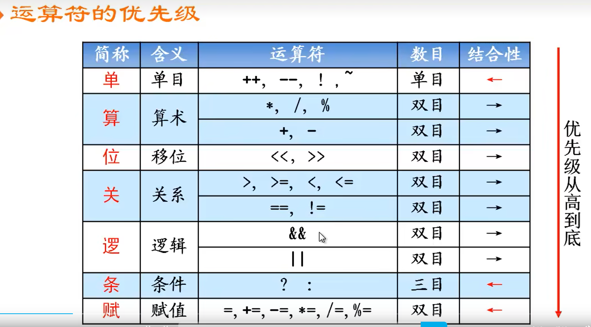
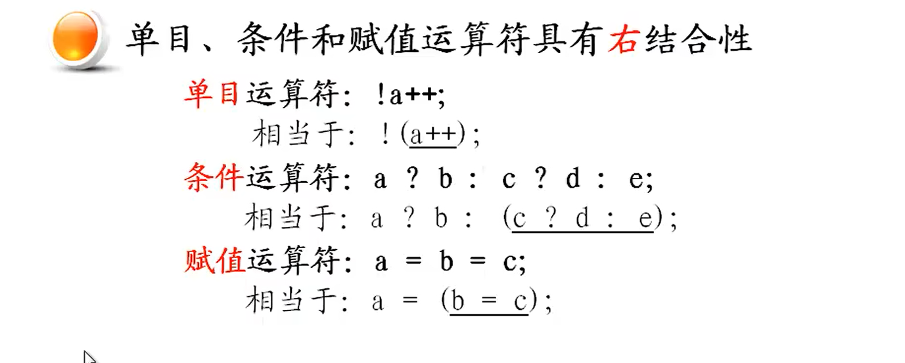
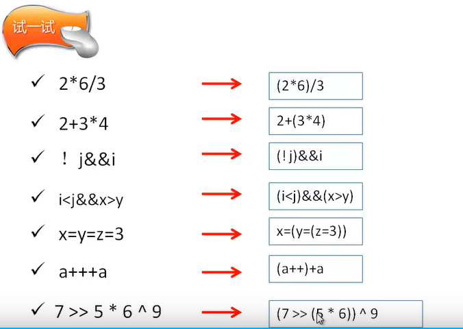
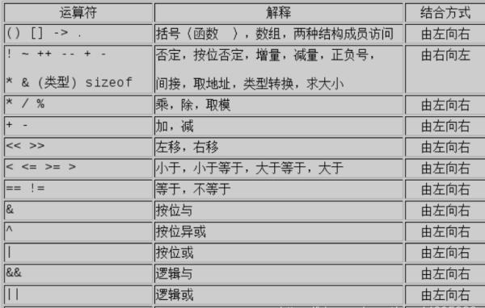

# 运算符的优先级 和结合性；

>优先级：
>
>* 括号和指针优先级最高； 
>
>* 单目运算符；  * &  算是单目吗？？是的；
>* 算术运算符；
>* 位运算符；
>* 关系运算；
>* 逻辑运算符；  
>* 条件运算符；
>* 赋值运算符；
>
>

---


## 运算符的优先级；

**位运算还有 ^ 异或  &  |  与或都是位运算符  是双目运算符；左结合性；**

**~非 是位运算符，但是是单目运算符；**

````php
//**逻辑没有异或运算。**

//**位异或指：异或运算^，异或运算它都是以二进制数据为基础进行运算，1^1=0　　0^0=1　　1^0=1　　0^1=1**

## 为什么逻辑异或不存在？？？？
##q：如果a和b的值都只能是0或1的话，a!=b其实就是异或，而且相比按位异或^，容易理解。

## 算术运算符 会高于移位运算符
##  L + ((H - L) >> 1);
````




---

## 结合性  

>下面是右结合性；
>
>其他的运算符是左结合性；



----

## （） 小括号；的作用

* 高的优先级；

* 可读性；提高可读性，整个很重要的；一般不需要特别清楚优先级的问题；只需要直到小括号优先级是最高的就行了；

  而且工作一般是一个协作的工作模式；所以为了提高代码的可维护性和可读性；所以这一篇优先级只需要了解一下就行；


---

## 案例：




## c语言的优先级


