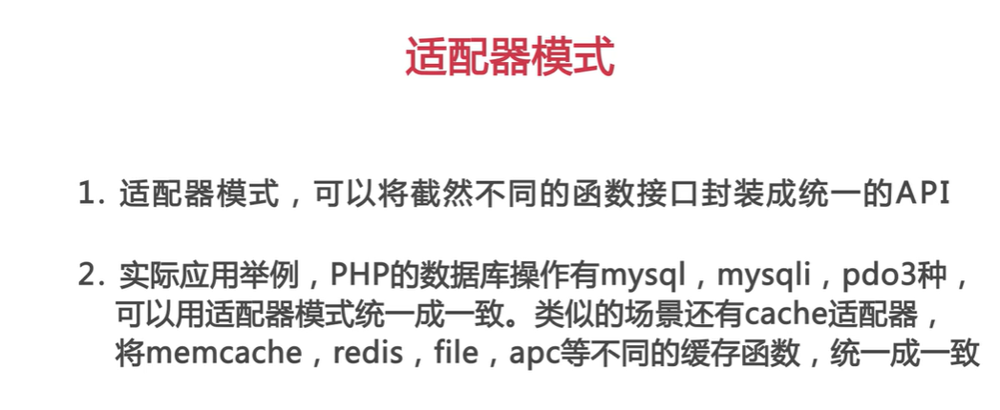
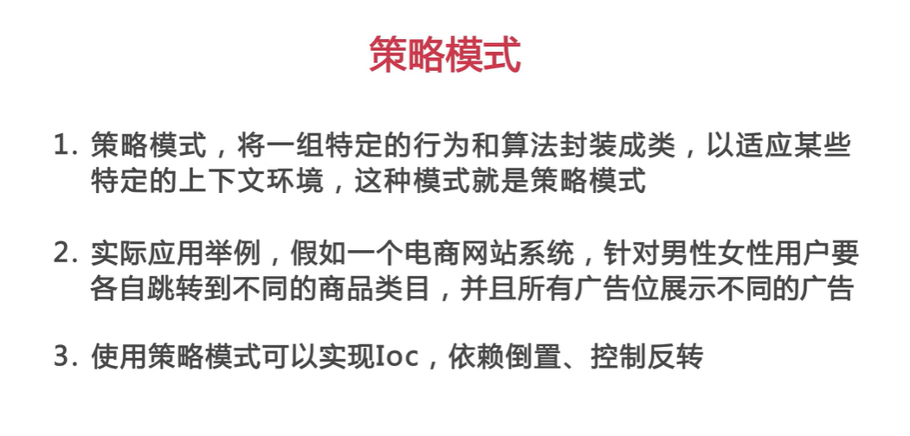
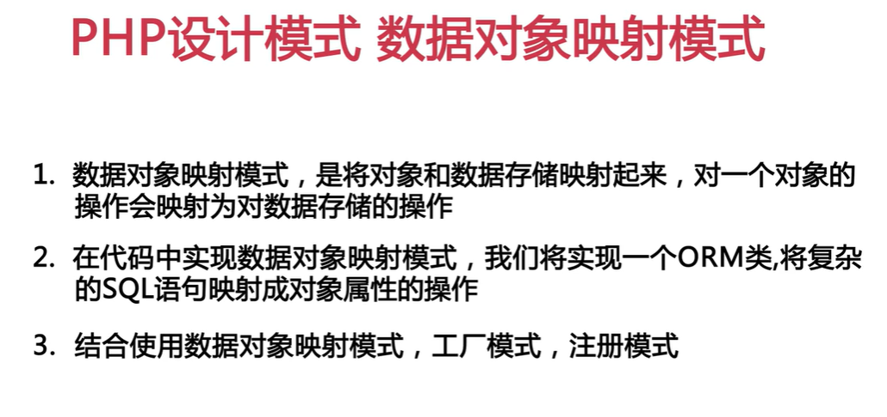
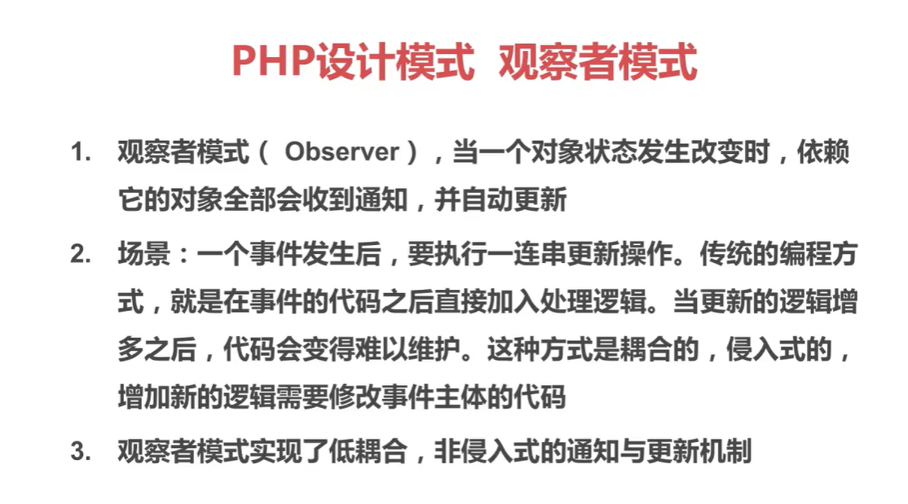
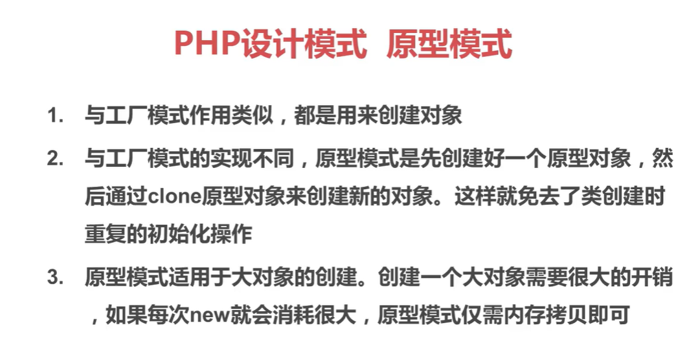
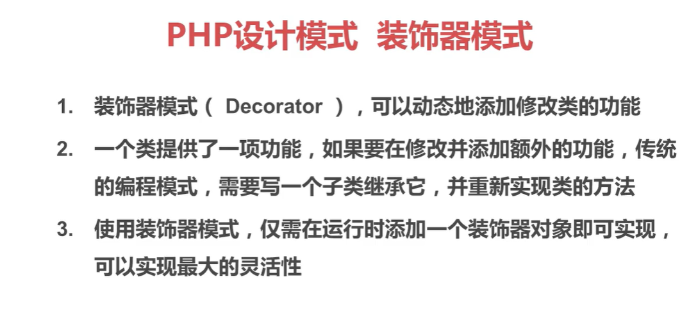
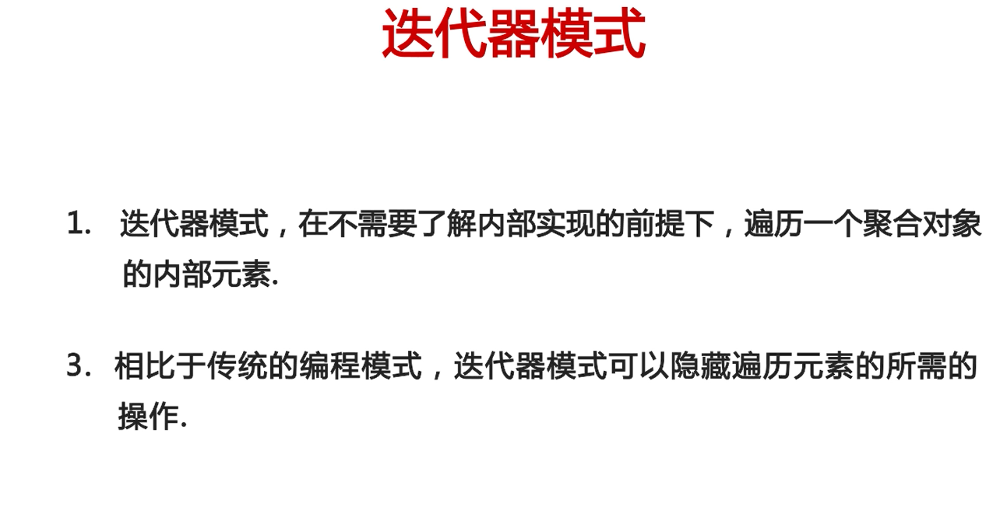
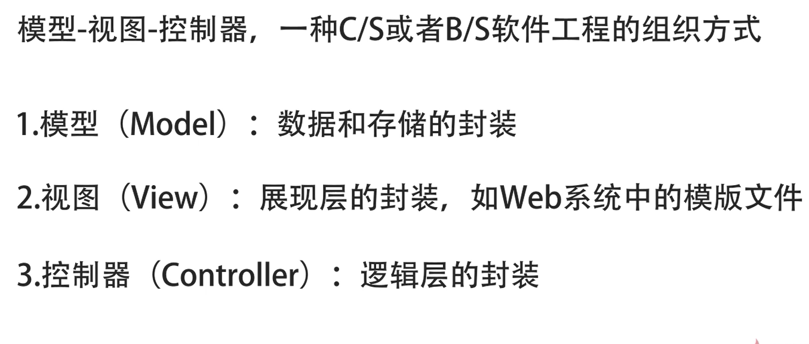

#面向对象---设计模式


工厂模式：用工厂来生成对象，而不是在代码中直接new； 直接new 是一个强的依赖关系，如果需要去修改new的对象，那么所有的都需要去修改，这边只需要去修改工厂就行了；

单例模式；一个类只生成一个对象，尤其是php资源类型的，日志，数据库，gd库，都一般用单例模式；

注册模式（容器）：全局共享和保存对象；


适配器模式：**可以将截然不同的函数接口封装成统一的API；**



策略设计模式：

**第三条就是对象之间的解耦，对象之间是一个低耦合的关系；只有数据的交互就是低耦合的关系；**





ORM* 是 Object Relational Mapping 的缩写,译为“对象关系映射”,它解决了对象和关系型数据库之间的数据交互问题


php数据对象映射模式； ORM  将对象和输出的存储映射起来；，对一个对象操作会映射为对数据存储的操作；





php 观察者模式；  这是一个异步的方式，设计模式；

一个事件发生后，需要做一系列的操作，然后返回成功；

我们可以异步的，发生实现之后并且成功之后，直接返回，后面的一系列操作也可以异步通知的形式去处理；

当我们去修改更新代码的话，我们就需要去修改代码，其实我们可以进行通知的方式，先创建一个对象监听事件，如果发生改变直接通知我们去执行就可以了；




原型设计模式

和 工厂类似，都用来创建对象；

clone 来创建新的对象，免去了类创建时重复的初始化操作；




装饰器设计模式  decorator

动态的添加修改类的功能；





迭代器设计模式

**在不需要了解，内部实现的前提下，遍历一个聚合对象的内部元素；**

**隐藏遍历元素所需要的操作；**




````php
// 继承迭代接口；
//  需要去写这些接口；
class User implements Iterator
{
    
}
````

'


'


MVC中自动加载配置； ------ 这里一定要自己写一下呀；


ArrayAccess  它可以让一个对象可以使用数组的访问方式来进行访问； 接口；

