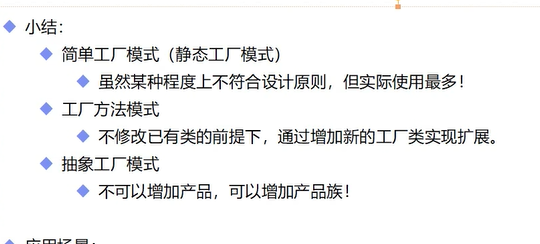

#OOP

>  <font color=red>注意当对象是稳定的并不会发生变化，只有一个实例，那么完全可以直接new，因为是稳定的，所以直接new就可以了，多注意一下，并不是不可以在对象里面new 别的对象；</font>
>
>  设计模式是什么？
>
>  就是在特定场景下解决问题的一种解决方案；
>
>  
>
>  一定要找到total，目标是什么，为什么要这么做？ 做了可以达到什么样的效果？
>
>  设计原则比设计模式更重要；
>
>  对象就是为了实现复用；
>
>  
>
>  主要核心思想；**应对变化，提高复用（抽象吧，也就是面向接口化；）；**  这个变化就是需求的频繁的变动；在变化点设计变化模式 ；
>
>  
>
>  **在变化的部分做抽象；然后依赖于细节，不应该依赖于实现；**
>
>  
>
>  找到稳定和变化的部分；
>
>  找出重复的部分； 然后复用；
>
>  找到变化的部分做抽象；
>
>  
>
>  可扩展性和可维护性；；
>
>  
>
>  ---
>
>  继承可以实现代码的复用；
>
>  抽象类和接口一个区别，抽象类，可以复用功能，但是接口不能；
>
>  因为 抽象类中可以有已经实现的方法，代表的是复用的部分的代码，接口，全部都是变化部分的代码；
>
>  没有实现的方法，就是代表变化的部分；
>
>  主要核心： 变化的部分做抽象；
>
>  ---
>
>  继承主要有三个作用：表示is-a关系、支持多态特性、代码复用。而这三个作用都可以通过其他技术手段来达成。比如is-a关系，我们可以通过组合和接口的has-a关系来替代；多态特性我们也可以利用接口来实现；代码复用我们可以通过组合和委托来实现。所以，**从理论上讲，通过组合、接口、委托三个技术手段，我们完全可以替换掉继承，在项目中不用或者少用继承关系，特别是一些复杂的继承关系。**


# 在变化的部分做抽象；目的就是解耦；解除（降低）类与类之间耦合度；


**特性：**		


封装 ：访问修饰符号；**隐藏消息,** 封装也是一种接口隔离的思想，本质就是消息隐藏，什么东西对外可见，什么东西对内可见，什么东西对子类可见！！


**根据行为进行封装，不要暴露实现的细节，最小化接口的暴漏**

**面向接口编程，而不是面向现实（对象）编程；**   **具体实现（对象就是一个具体的实现）是变化的；**      **接口是稳定的；**


继承：**代码的复用；**

`````c
//  继承设计； c++
//实现继承 或者是接口继承？复用性的
子类继承父类，子类继承父类的数据成员，子类内存里面就会有父类的数据成员，那么子类里面就会有父类的数据成员；子类继承父类的函数成员，那么字类就可以调用父类的函数成员；
// 接口继承
  字类继承父类的公有接口，表明我遵从你公有接口的合约（is -a），你可以把字类当成父类来使用；
`````


多态：改写对象行为；重写和重载；   


**重写就是同一个父类的实例，调用相同的方法，会有不同的效果；**     **并不是原封不动的继承父类的方法，是想做一部分的修改；**

相同父类但是不同对象的实例的多态；

``````php
// 同一个父类的实例 调用相同的方法会有不同的效果；


/**
 * 重写
 * 相同父类的实例，调用相同的方法，会有相同的效果；
 * 抽象类；
 */
abstract class Animal
{
    abstract public function run();
}

class tuzi  extends Animal
{
    public function run(){
        echo "ruzi pao";
    }
}

class Wugui extends Animal
{
    public function run() {
        echo "wugui man";
    }
}
``````


**重载就是相同的方法名，根据传入的参数不同，会展示不同的效果；**    **参数的不同表现在：**参数个数不同，参数类型不同，参数顺序不同

同一个对象，参数的不同会展示不同的效果；不支持传统的重载；但是可以实现伪的重载；

传统的重载，**就是相同的方法名根据我们传入的参数的不同来实现不同的形态；**

伪的重载的实现：func_nums_args(); func_args();


```php
/**
 * 伪重载的实现
 * ...可变数量的参数列表；
 	...可变参数;
 */

class CeshiCe
{
    public function ceshi($ceshi,$ceshi1) {
        var_dump(func_get_args()); // array
        echo "\n";
        echo func_num_args(); //2
    }

    public function ceshi1(...$args) {
        var_dump(...$args);die;
    }
}
$obj = new CeshiCe();
$obj->ceshi(1,2);
//$obj->ceshi1(1,2,33,4,4); //输出每个参数；
/*/opt/project/Project/Index.php:484:
int(1)
/opt/project/Project/Index.php:484:
int(2)
/opt/project/Project/Index.php:484:
int(33)
/opt/project/Project/Index.php:484:
int(4)
/opt/project/Project/Index.php:484:
int(4)*/

$obj->ceshi1([1,2233,]);  // array


function ceshi1111(...$args){
    var_dump($args);  //  这是一个东西
}
ceshi1111([1,234,44,]);
function ceshi222(){
    var_dump(func_get_args());die;		
}
ceshi222([1,234,44,])
//result  ...args  ==== func_get_args  可变参数；
array(1) {
  [0] =>
  array(3) {
    [0] =>
    int(1)
    [1] =>
    int(234)
    [2] =>
    int(44)
  }
}
```


---


### 原则

> **主要是满足这两个需求：高内聚和低耦合；**


抽象的定义：

看不懂是因为有黑话，诸如高级模块，低级模块，抽象，实现等，翻译成白话就好理解了
以Java为例

**抽象=接口或抽象类 细节=接口或抽象类的继承类实现**


**因为抽象代表一种类型，是泛指；而细节则是抽象的具体实现，是特指；故而抽象是更高级的模块。**

----


### 高内聚和低耦合；


**低耦合：模块之间的依赖程度；**  可扩展性 可复用性；

**高内聚：模块内的元素的相似程度；**  可靠性  可读性；


3.可读性

程序的内容清晰、明了、便于阅读和理解，没有太多繁杂的技巧。对于大规模、工程化开发软件而言，可读性指标具有非常重要的作用。为提高程序的可读性，可在程序中插入解释性语句，以及对程序中的变量、功能、特殊处理细节等进行解释，为今后他人读该段程序提供方便。

4.可维护性

**可维护性是指程序各部分相互独立，程序之间只有数据联系。**也就是说不会发生那种在维护时牵一发而动全身的连锁反应。一个规范性、可读性、结构划分都很好的程序模块，它的可维护性也是比较好的。

1.可靠性

可靠性指标可分解为两个方面的内容:一方面是程序或系统的安全可靠性，这些工作一般都要靠系统分析和设计时来严格定义。另一方面是程序运行的可靠性，这一点只能靠调试时的严格把关来保证编程工作的质量，程序的功能必须按照规定的要求，满足预期的需要。

---


SOLID；

---

###**迪米特法则：** 第六原则，最少知道原则，是指一个对象类对于其他的对象类来说，知道的越少越好；

也就是说两个类不要有过多的耦合关系；

校长，老师，学生；校长不需要去了解，学生的具体成绩，只需要知道总分和平均分就可以了；

---


###依赖置换DIP：**Dependency Inversion Principle,DIP**

>**就是在变化的部分做抽象；**
>
>**面向接口编程；面向抽象编程；** 

* 高层模块不应该依赖于底层模块（抽象的具体实现）（变化，车轮的变化，今天用这个，明天用这个，后天用这个，所以这里要），二者都应该依赖于抽象（抽象类，稳定）；

  抽象就是抽象类和接口；泛指；
  底层模块就是父类；

  高层模块就是子类的调用者；

  

  **调用者就是高层模块；**

  **被调用者就是底层模块；**

  

* 抽象（稳定）不应该依赖于实现细节（实现），实现细节应该依赖于抽象（稳定）；

   

* total：解耦，解除子类和父类的

  

  **任何变量不应该指向一个具体的类；**

  **任何类都不应该继承自具体类；**


---


###单一职责原则（SRP）： 只有一个职责； **Single ResponsiblityPrinciple SRP**  （根据是否是高内聚特性来做拆分；）


**一个类只干一件事情（一个类只负责一个功能（职责））；极限情况就是一个类仅仅只有一个方法，肯定是单一职责的；但是也要注意同一个类的各个方法关联性是否很强，是否表现出高内聚性，可不可以去拆分，比如每一个方法都用到了同一个子方法，那么就不能去拆分；**


* **一个类，仅有一个引起它变化的原因；**
* **一个类仅有一个引起它变化的原因意味着一个类应该只有一个责任或职责。这意味着一个类应该只有一个改变它的原因，也就是说，当需求发生变化时，只有一个原因会导致该类发生变化。**
* 变化的方向隐含着类的责任；

`````php
是的，单一职责原则的变化方向隐含了类的责任。当需求发生变化时，我们应该关注变化的原因，并将其与现有的类的职责进行比较。如果变化的原因只涉及到一个特定的职责，那么我们应该将变化的逻辑从原有的类中分离出来，创建一个新的类来处理这个职责。

这种分离的好处是可以使代码更加清晰、可维护和可扩展。每个类只负责一个特定的职责，使得代码的逻辑更加集中和一致。当需求发生变化时，我们只需要修改与变化相关的类，而不会影响到其他类的功能。

通过遵循单一职责原则，我们可以提高代码的可读性和可维护性。每个类都有清晰的职责，使得代码更易于理解和调试。此外，当需要对系统进行扩展时，我们可以更容易地识别和修改与扩展相关的类，而不会影响到其他部分的代码。

总之，单一职责原则的变化方向隐含了类的责任，帮助我们设计出更加模块化、可扩展和可维护的代码。
`````


----


###**里氏替换（L）**：**需要父类的地方都可以使用子类来代替，而不用使用额外的代码；    **     **LiskovSubstitution Principle,LSP**

* **子类必须能够替换他们的基类**；**（is-a）** **继承关系 都是is-a** ；
* 具体实现子类继承一个父类，你会发现有很多方法你根本不能用；

**任何方法都不应该改写父类中已经实现的方法，但是可以去重写抽象方法；**


这边可以 用多继承来实现，或者组合来实现！！！；

---


###开闭原则（OCP） ： **扩展开放，修改封闭；**       **策略模式；** **Open Closed Principle,OCP**，     **这个是达到的目的；**

**比如有1，2两个模块，当你想又要add一个3的模块的时候，不能对原先的模块产生影响（不能去修改原先的模块）；**


----


###**接口隔离（ISP）：Interface Segregation Principle,ISP**      设计接口的采用的原则；

>一个类对于另外一个类的依赖  应该建立在最小接口上；
>
>如果一个接口很复杂，可以返回很多数据，那么调用者肯定会很多，当我们去修改的时候就会影响到其他的调用者；只有这样才表现出低耦合的特性；
>
>使用多个专门的接口，而不是使用单一的总接口；他会返回调用者一个很复杂的数据结构，调用者从很多数据里面拿到自己星耀的数据，很多调用者都可以通过这个接口来实现；那么如果某一个调用者需要的数据结构发生改变，就会影响到其他的调用者；

* **不应该强迫客户程序依赖他们不用的方法；**   **(客户端不应该依赖它不需要的接口；（因为当你不需要它却需要去实现它；）)**

* **接口应该细分，不应该在一个接口中放很多方法；**

* **一个类对一个类的依赖应该建立在最小的接口上；** 

  

  ``````c
  //不要把一些不必要的方法public ，如果是本类使用就private ，如果是子类使用就protected；
  //只有 有必要暴漏出去的时候才做成public;
  //客户程序就是使用它的程序；
  //如果全部做成public 很容易，使用它的客户产生依赖，接口一定要稳定，不然就会出问题！！！1
  ``````
  
  
  
  **可以多继承，来实现接口的隔离；** 
  
  `````php
  // 接口的多继承 接口可以继承接口；
  interface CacheClient extends  Ijiekou1,Ijiekou
  {
      
  }
  #也可以直接 
  /**
   * class A exntends B implements IC,ID
      {
      use TE;
      }
   * 多继承的问题
   */
  class B {
      public function ceshi() {
          echo "ceshi";
      }
  }
  interface IC
  {
      public function ceshi1();
  }
  
  interface ID
  {
      public function ceshi2();
  }
  trait TE
  {
      public function ceshi3() {
          echo "ceshi3";
      }
  }
  trait TF
  {
      public function ceshi4() {
          echo "ceshi4";
      }
  }
  # 先继承再实现 然后trait;
  class A extends B implements IC,ID
  {
      #trait 和interface的区别 trait时已经实现的方法，而interface 是一个抽象的方法，需要不同的类去自己去实现；
      use TE,TF;
  
      public function ceshi1(){
          echo "ceshi1";
      }
  
      public function ceshi2() {
          echo 'ceshi2';
      }
  }
  
  $obj = new A;
  $obj->ceshi4();
  echo "\n";
  $obj->ceshi3();
  echo "\n";
  $obj->ceshi2();
  echo "\n";
  $obj->ceshi1();
  
  `````
`````php
  
**接口隔离和单一职责的关系？？？？**
  
单一职责原则； 一个来最好只干一个事情，影响类变化的原因只有一个； 实现高内聚（模块内部元素的相似程度）相似程度比较高，就代表这个类干了一件事情，那么肯定是单一职责的；
  
接口隔离：实现低耦合（模块之间依赖程度）；
  

  
**eg： 一个公司会分为很多部门：人事，财务，运营，产品等等，这个是一个接口的隔离；低耦合的；**
  
​	**但是一个部门只负责一件事情这是单一职责，实现高内聚；**
  

  
   

-----

###**合成复用原则**  

**使用组合不适用继承 但是 php 是满足多继承的 完全可以使用多继承来解决这个问题； java 是单继承，所以需要组合的方式来解决;php 直接使用多继承就可以了；**

**继承是一种高耦合的现象；**

​````php
# php支持多继承； 不要去修改基类；  因为 说不定别人不需要这个类；
# 如果是一个一维的可以使用trait 多继承；如果是多个维度就需要使用组合了；组合一般用于多个维度；只需要n+m个对象就行；
# 而如果多维度用继承需要产生n+m+n*m就可以了；
# 说白了，一个对象会有多个变化部分，如果要用继承那么要生成n*m个对象，如果用继承那么就是 n  + m个对象就够了；??? 仔细看一下；
# n 和 m分别代表两个变化的维度；

class A
{
    public function method1 {
        
    }
    
    public function method2 {
        
	}
    
}


class B extends A
{
    
}


//当是我们对A做扩展了，add method3 本身B是不需要method3 所以就会出问题；但是php完成可以使用多继承来解决；
//修改基类A会影响刀B；

trait AExtend
{
    public function method3 () {
        
    }
}

class C extends A
{
    use AExtend;
}

//组合的写法  单个 维度那么就直接用 trait 就行； 写起来比较简单；

class AExtend
{
    public function method3(){
        
    }
}
//
class C extends A
{
    private $extend;
    
    // 低耦合  根据传递的对象不同执行不同的方法；
    public function __construct(AExtend $extend){
        $this->extend = $extend;
    }
    
    public function method3 () {
	 	$this->extend->method3();
    }
}
````


----


###**迪米特原则：最少知识原则；设计类的时候采用的原则；**

**减少类之间的耦合度；**


**一个对象应该对其他的对象有最少的了解；**


比如一些**工具类**用的还是比较多的，我们不需要去了解它具体来的实现逻辑和顺序；直接去调用接口就行了；


```php
class Computer
{
    public function saveCurrentTask() {

    }

    public function closeScreen() {

    }

    public function closePower() {

    }

    public function closeComputer() {
        $this->saveCurrentTask();
        $this->closeScreen();
        $this->closePower();
    }
}

class VeryCoolMan
{
    // 如果关闭电脑又细化了，那么需要操作的步骤会更多，如果有30多步骤，我们需要每个步骤都又一个了解，才能写出来；这样类与类之间了解的太多了；
    // 耦合性就会很强；
    public function closeComputer(Computer $computer) {
//        $computer->saveCurrentTask();
//        $computer->closeScreen();
//        $computer->closePower();
        $computer->closeComputer();
    }
}
```


### 工厂方法

对象创建模式


通过**对象创建模式绕开new**，来避免**对象创建（new）过程中所导致的紧耦合**（**依赖具体的类**），从而支持对象创建的稳定，他是抽象接口之后的第一步工作；

**如果 创建一个新具体类 直接创建一个具体类，和创建一个具体的方法就可以了；**


**创建了一个工厂但是可以使用很多次；**


工厂方法  你必须不知道 你要创建什么样的对象，只知道创建对象的规则也就是工厂；


那么就可以使用工厂 来生产这个对象；

你根本 不知道需要什么样子的对象； 工厂；


依赖注入  你已经确定某一个对象了，所以直接注入就可以了；


**php的多继承就是java中的组合**


####面向接口编程；

    只有数据的交互，低耦合；


很显然，面向接口编程就是编码时使用接口而不是具体的对象。

所以首先你要知道什么是接口，什么是对象。因为和问题不直接相关，所以不具体解释。

那为什么要面向接口编程呢？其实主要是为了解耦。我定义一个接口，我甚至不知道别人会怎样实现它，我的系统用谁的具体实现都能正常工作，甚至没有具体实现也能正常工作，别人一点都不会影响我，这就是[解耦](https://www.zhihu.com/search?q=解耦&search_source=Entity&hybrid_search_source=Entity&hybrid_search_extra={"sourceType"%3A"answer"%2C"sourceId"%3A613340038})。**反之，没有别人的具体实现我的程序就废了，或者我只能在A的具体实现上工作，B的就不行，这就是强耦合。**

举个例子：我所做的功能是登录（Login），其他人可能需要在登陆后做一些动作，比如统计总的登陆次数，我不知道其他人会做什么动作，所以我只提供了一个接口LoginEvent，其内有一个动作doSomething，代码如下（JAVA）

```java
public class Login{
    private List<LoginEvent> loginEvents = new ArrayList<>();
    public addLoginEvent(LoginEvent e){
        loginEvents.add(e);
    }

    public void afterLogin(){
        for(LoginEvent e : loginEvents){
            e.doSomething();
        }
    }
}
```

实现者代码如下

```text
public class LoginCounter implements LoginEvent{
    public void doSomething(){
        // 统计登陆次数的代码
    }
}

new Login().addLoginEvent(new LoginCounter());
```


### 工厂模式


**目的** ： **实例的调用者和创建者解耦；**


**创建一个对象的时候不需要new，直接调用工厂就行；**       **工厂产生一个对象**


**用户不应该去创建自己的实例（不需要自己去new），只需要去找工厂生产就可以了；**

车工厂也是变化的，随着车会有不同的工厂，所以工厂也需要做抽象；


**每个车都会有一个工厂，来实现开闭原则；**


**简单工厂只有一个工厂；** 这里是否就是代理模式？

**工厂方法会有很多工厂；每一个产品都会有一个工厂；**


简单工厂：不满足开闭原则；但是实现起来比较简单，所以实际案例也会比较多；

工厂方法：满足开闭原则的前提下，是通过创建新的工厂类实现扩展；一个工厂就代表着一个工厂；


**抽象工厂：缺点：不可以增加新的产品，但是可以增加产品族；**

优点：一个工厂可以产生多个对象，所以效率比较高；





### 代理模式

中介； 正向代理；

分为四分部：


抽象功能 rent interface   real拥有者拥有的能力；


代理者

real拥有者

客户


### 设计模式的几种类型 创建 结构 和行为


创建型模式提供了创建对象的机制， 能够提升已有代码的灵活性和可复用性。


结构型模式介绍如何将对象和类组装成较大的结构， 并同时保持结构的灵活和高效。


行为模式负责对象间的高效沟通和职责委派。


`````


